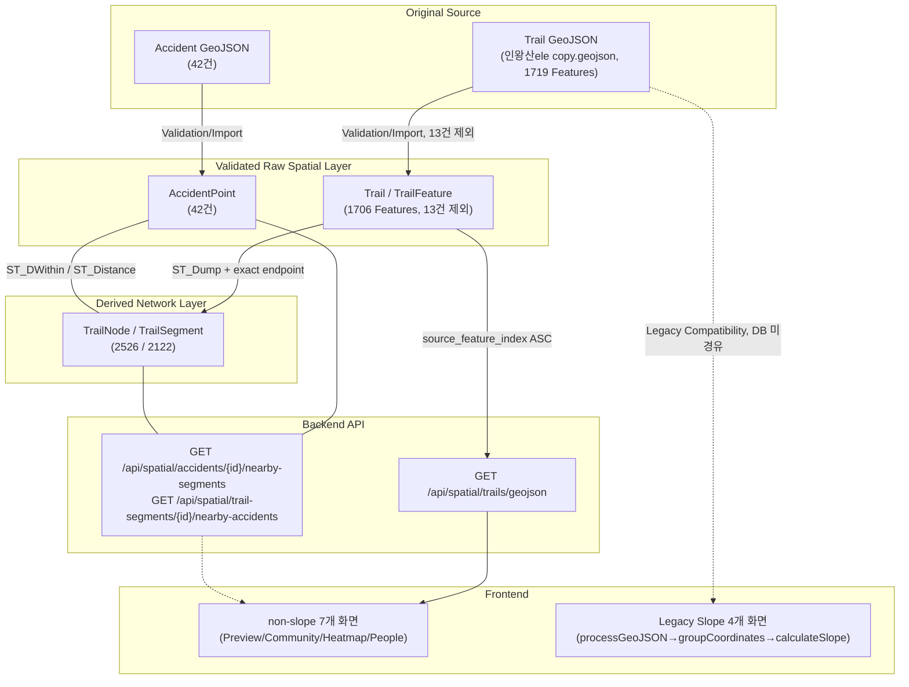
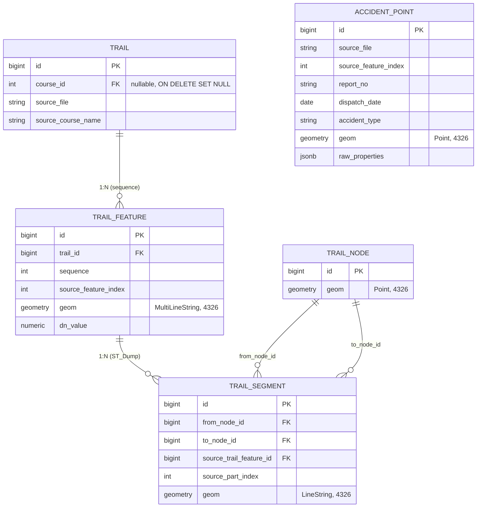

# 안전 등산 플랫폼 (Safety Hiking Platform)


이 저장소는 두 개의 서로 다른 작업을 담고 있다.

1. **원본 프로젝트**: 2024년 LX 공간정보 아카데미 최종프로젝트로 팀 단위로 개발한 등산 안전
   플랫폼(국토교통부 장관상 대상 수상, 15번 섹션 참고).
2. **이번 리팩터링**: 원본 프로젝트 종료 후, 저장소 소유자가 개인적으로 진행한
   **PostgreSQL/PostGIS 기반 공간정보 Backend 리팩터링**. 이 README는 이 리팩터링을 중심으로
   작성됐다.

원본 팀 프로젝트를 "처음부터 PostGIS 프로젝트였다"고 서술하지 않는다 — 아래 2번에서 두 작업의
경계를 명확히 구분한다.

---

## 1. 리팩터링 배경 — 무엇이 문제였는가

원본 프로젝트는 등산로/사고 데이터를 다음과 같은 방식으로 다뤘다.

```text
등산로/사고 GeoJSON 정적 파일 (frontend/public/data/*.geojson)
        ↓
Frontend가 직접 fetch → 좌표 flatten → 지도에 렌더링
```

이 구조를 실제 코드/데이터로 분석한 결과 다음 문제를 확인했다([코드 확인]/[데이터 확인] 태그는
`docs/` 각 문서에 남아 있다).

| 문제 | 실측 근거 |
|---|---|
| 공간 데이터가 DB가 아닌 정적 파일로만 존재 | 15개 이상의 Frontend 화면이 같은 GeoJSON 파일을 각자 fetch |
| 원본 GeoJSON Feature와 위상학적 Network Edge 개념이 분리되어 있지 않음 | Feature 경계는 데이터 생성 과정의 산물일 뿐, 실제 연결 구조와 무관 |
| 원본 GeoJSON에 구조적으로 무효한 Feature 존재 | 1719건 중 13건(좌표 1개짜리 degenerate LineString 등) |
| 경사 색상 표현이 좌표 배열을 고정 크기로 자르는 Frontend 로직에 의존 | `groupCoordinates(N)` — N은 화면마다 5/7/12로 제각각 |
| 사고 데이터도 지도 표시 전용으로만 사용됨 | 실제 Raw 사고 좌표(42건)와 화면 표시용 가공 데이터(15건)가 섞여 있었음 |

"원본 프로젝트가 잘못 설계됐다"는 뜻이 아니다 — 아카데미 프로젝트의 목표(제한된 기간 내 풀스택
데모 완성)와 이번 리팩터링의 목표(공간 데이터의 구조적 Backend 관리 + 검증 가능성)가 달랐을
뿐이다.

---

## 2. 핵심 개선

| # | 개선 | 한 줄 요약 |
|---|---|---|
| 1 | GeoJSON → PostGIS Raw Spatial Modeling | `Trail`/`TrailFeature`로 검증을 통과한 1,706개 Feature의 출처(`source_feature_index`)·경계·geometry를 보존하고, 제외된 13건은 Manifest로 명시 추적 |
| 2 | Raw / Network Layer 분리 | `TrailFeature`(Validated Raw)와 `TrailNode`/`TrailSegment`(`ST_Dump` + exact endpoint 매칭으로 파생된 Derived Network baseline)를 별개 계층으로 설계 |
| 3 | AccidentPoint 독립 Raw Layer + 동적 공간관계 | 사고 42건을 FK 없이 `ST_DWithin`/`ST_Distance`로 TrailSegment와 질의 시점에 연결 |
| 4 | 기존 기능 보호를 위한 Hybrid Migration | 데이터 정제가 기존 경사 렌더링 로직과 충돌하는 것을 발견하고, 안전한 화면만 DB API로 전환 |
| 5 | Fresh Rebuild / Regression / Performance 검증 | 별도 DB에서 전체 파이프라인 재현 + 93개 자동 테스트 + 실측 성능 baseline 확보 |

---

## 3. Architecture



**Legacy Compatibility Boundary**: 위 다이어그램에서 `Legacy` 4개 화면은 의도적으로 DB/API를
거치지 않고 원본 GeoJSON을 직접 읽는다 — 이유는 6번 Design Decision 참고.

현재 Network는 `TrailFeature.geom`을 `ST_Dump`로 분해한 LineString Part의 endpoint가 정확히
일치하는 지점만 `TrailNode`로 묶는 **exact endpoint matching 기준 baseline**이다. 좌표 오차를
보정하는 snapping/tolerance나 선 내부 교차점(interior intersection) 자동 분할(`ST_Node`/
`ST_Split`)은 적용하지 않았다 — 10번 Known Limitations 참고.

---

## 4. Spatial Data Model



**`AccidentPoint`에는 `trail_segment_id` 같은 FK가 없다** — 아래 표처럼 질의 시점에 공간
연산으로만 관계를 계산한다(6번 Design Decision 참고).

```text
AccidentPoint  ⇄(ST_DWithin/ST_Distance, 질의 시점 계산)⇄  TrailSegment
```

---

## 5. `TrailFeature` vs `TrailSegment` — 반드시 구분해야 하는 개념

```text
TrailFeature = 검증을 통과한 원본 GeoJSON Feature의 구조와 출처를 보존하는 Raw Spatial Data
TrailSegment = ST_Dump로 분해한 LineString Part를 exact endpoint 기준 TrailNode와 연결한
               Derived Network Edge (exact-endpoint 기반 Network baseline)
```

"원본 Feature 1개 = Segment 1개"가 아니다. 실측 결과 `TrailFeature`(1706건)를 `ST_Dump`로
분해하면 **2122개의 LineString Part**가 나오고, 이 2122개가 그대로 2122개의 `TrailSegment`가
된다(Feature 하나가 여러 Part/Segment로 쪼개질 수 있다는 뜻). 이 둘을 같은 테이블로 합쳤다면
"원본 보존"과 "파생 Network 표현"이라는 서로 다른 책임이 뒤섞여, 향후 Network를 다시 계산할 때
원본 데이터가 훼손될 위험이 있었다 — 그래서 Phase 4 진행 중 이 실수를 발견하고
(`trail_segment`라는 이름의 원본 보존 테이블 → `trail_feature`로 개명) 두 계층으로 분리했다.
단, `TrailSegment`가 Part 단위라는 사실이 곧 "모든 실제 교차점 사이의 최종 Segment"라는 뜻은
아니다 — 아래 정량 검증은 Part↔Segment의 1:1 geometry 대응만 확인한 것이며, 선 내부 교차점
noding까지 마친 완전한 routing topology는 아니다(10번 Known Limitations 참고).

**정량 검증 결과**([데이터 확인], `docs/07-testing-and-performance.md`):

| 지표 | 값 |
|---|---:|
| TrailFeature (Raw) | 1706 |
| ST_Dump LineString Part | 2122 |
| TrailNode | 2526 |
| TrailSegment | 2122 |
| Raw Part ↔ TrailSegment geometry parity | **2122 / 2122 일치** |
| Raw ↔ Network 전체 길이 차이 | **0.000000 m** |

---

## 6. 주요 Design Decision

핵심 판단만 요약한다(면접 대비용 상세 Q&A는 `docs/08-portfolio-summary.md`).

- **왜 TrailFeature와 TrailSegment를 분리했는가**: 5번 참고 — 원본 보존과 파생 Network는 책임이
  다르고, 합치면 재계산 시 원본이 훼손될 위험이 있다.
- **왜 AccidentPoint에 `trail_segment_id` FK를 두지 않았는가**: 42건 전체에서 최근접
  Segment와 두 번째로 가까운 Segment의 거리 차이가 5m 미만인 경우가 100%였다(Segment 중앙값
  길이 약 3m로 매우 촘촘하기 때문) — "가장 가까운 것 하나"를 영구 고정하는 것이 데이터를 왜곡한다.
  게다가 `TrailSegment`는 언제든 재생성 가능한 Derived 데이터라 FK 대상으로 부적절하다.
- **왜 13개 무효 Feature를 API 응답에 다시 섞지 않았는가**: 좌표 1개짜리 degenerate
  LineString처럼 구조적으로 무효한 공간 객체를 "기존 화면 호환"을 이유로 다시 서비스하면 DB
  Source of Truth 원칙이 무너진다.
- **왜 Legacy Slope 4개 화면만 원본 정적 파일을 유지했는가**: DB Validated Source(1706건)를
  기존 경사 계산 로직(`groupCoordinates`, 좌표 배열을 고정 크기로 자르는 위치 기반 연산)에 그대로
  대입해봤더니, 제외된 Feature 때문에 좌표 스트림이 밀리면서 마루 코스 29.6%, 홍제동구간 39.5%
  (groupSize=5 기준)의 렌더링 그룹 색상이 원본과 달라지는 것을 실측했다. 이를 "미완료 마이그레이션"이
  아니라 **의도적인 Compatibility Boundary**로 설계했다 — Validated DB Source는 일반 기능에,
  Original Static Source는 Legacy 경사 렌더링에 쓴다.
- **왜 geography functional index를 바로 추가하지 않았는가**: `EXPLAIN ANALYZE`로 확인한 결과
  현재 규모(TrailSegment 2122건, AccidentPoint 42건)에서 `ST_DWithin(geom::geography, ...)`가
  Seq Scan으로도 수십 ms 이내였다 — 측정 근거 없는 조기 최적화를 피했다.
- **왜 `DN`을 실제 고도라고 주장하지 않는가**: 인왕산 정상고도(약 338m)를 초과하는 DN 값(최대
  655)이 존재하고, 3D 뷰는 별도 지형 API로 고도를 샘플링한다 — 반증에 가까운 정황만 있고 원본
  데이터 제공처를 확인할 수 없어 "물리적 고도"라고 확정하지 않는다.

---

## 7. Backend API

### Trail GeoJSON API — 일반 지도 렌더링용

```text
GET /api/spatial/trails/geojson
```
- Source: `TrailFeature`(Validated Raw Layer), `TrailSegment` 아님(원본 Feature 경계 보존 필요)
- 정렬: `source_feature_index ASC` (원본 FeatureCollection의 절대 순서 보존)
- 좌표 정밀도: `ST_AsGeoJSON(geom, 15)` (기본값 9자리는 원본보다 정밀도가 낮아 명시 지정)
- 응답 예시(일부):
```json
{
  "type": "FeatureCollection",
  "features": [
    {
      "type": "Feature",
      "properties": { "PMNTN_NM": "마루", "DN": 116 },
      "geometry": { "type": "MultiLineString", "coordinates": [ [[126.958485864, 37.612176397], ...] ] }
    }
  ]
}
```

### Spatial Query API — AccidentPoint ↔ TrailSegment 동적 공간질의

```text
GET /api/spatial/accidents/{accidentId}/nearby-segments?distanceMeters=N
GET /api/spatial/trail-segments/{segmentId}/nearby-accidents?distanceMeters=N
```
`distanceMeters`는 **공간 연관 조회 반경**이며 "위험 반경"이 아니다 — 실측 결과 42건의 사고
좌표 중 76%가 Trail Network에서 100m 이상 떨어져 있어, 특정 거리값을 위험/안전 기준으로 주장할
근거가 없다(`docs/05-accident-spatial-query.md`).

---

## 8. 검증 결과

| 항목 | 결과 |
|---|---|
| Backend 자동 테스트 | **93 / 93 PASS** |
| Frontend production build | PASS (신규 경고/에러 0건) |
| Geometry integrity 위반(4개 테이블 전수) | **0건** |
| Raw ↔ Network geometry parity | **2122 / 2122**, 길이차 **0m** |
| Fresh Rebuild(별도 DB에서 전체 파이프라인 재구성) | Dataset 4/1706/2526/2122/42 **동일 재현** |
| Trail GeoJSON API(local, warmup 5회+측정 30회) | 458,796 bytes, **median 8.78ms, p95 10.51ms** |

- 위 API 응답시간은 **local Docker, localhost 환경**에서 측정한 값이며 production latency가
  아니다.
- **실제 browser 화면 육안 확인은 수행하지 않았다** — 대신 Node로 각 화면의 실제 GeoJSON 소비
  함수를 라이브 API 응답에 직접 실행해 예외 없이 정상 동작함을 확인했다(`docs/06`). "Browser
  E2E PASS"라고 주장하지 않는다.
- 상세 Import/Network Build/공간질의 성능, EXPLAIN 실행계획은 `docs/07-testing-and-performance.md`.

---

## 9. Quick Start

```bash
# 1) PostgreSQL/PostGIS 기동
cp .env.example .env   # 값 채우기
docker compose up -d

# 2) 관계형 + 공간 Schema 적용
docker exec -i safety_hiking_postgis psql -U safety_hiking_app -d safety_hiking \
  < backend/src/main/resources/db/postgresql/schema.sql
docker exec -i safety_hiking_postgis psql -U safety_hiking_app -d safety_hiking \
  < backend/src/main/resources/db/postgresql/seed.sql
docker exec -i safety_hiking_postgis psql -U safety_hiking_app -d safety_hiking \
  < backend/src/main/resources/db/postgis/spatial-schema.sql
docker exec -i safety_hiking_postgis psql -U safety_hiking_app -d safety_hiking \
  < backend/src/main/resources/db/postgis/network-schema.sql
docker exec -i safety_hiking_postgis psql -U safety_hiking_app -d safety_hiking \
  < backend/src/main/resources/db/postgis/accident-schema.sql

# 3) 공간 데이터 Import (one-shot batch, 각 profile 실행 후 종료됨)
cd backend
SPRING_PROFILES_ACTIVE=spatial-import ./mvnw spring-boot:run
SPRING_PROFILES_ACTIVE=spatial-network-build ./mvnw spring-boot:run
SPRING_PROFILES_ACTIVE=spatial-accident-import ./mvnw spring-boot:run

# 4) Backend 실행
./mvnw spring-boot:run
# → GET http://localhost:9000/api/spatial/trails/geojson 로 1706 Feature 확인 가능

# 5) Frontend 실행 (별도 터미널)
cd frontend
npm ci
npm run serve
# → http://localhost:8080, devServer가 /api를 9000으로 프록시
```

이 순서는 Phase 10에서 별도 임시 DB(`safety_hiking_bench`)에 실제로 적용해 Dataset
(4/1706/2526/2122/42)과 API가 동일하게 재현됨을 확인한 순서다(`docs/07`).

---

## 10. Known Limitations

```text
- Trail Network는 exact endpoint topology baseline이며 snapping/tolerance를 적용하지 않았다
  (마루 코스가 391개 connected component로 분절되어 있음)
- 원본 1719 Feature 중 13건(공백 PMNTN_NM 4건 + geometry 무효 9건)을 Raw Layer에서 제외했다
- `DN`의 물리적 의미(실제 고도인지)는 검증되지 않았다 — Legacy slope는 실제 경사율이라고
  주장하지 않는다
- AccidentPoint 원본 좌표의 위치 정밀도(GPS 실측 vs 신고 시스템 근사값)는 검증되지 않았고,
  42건 중 76%가 Trail Network에서 100m 이상 떨어져 있다
- 사고 지도 마커용 15건 데이터셋은 Raw Source가 아니라 Frontend 표시 전용 가공 데이터다
- Legacy Slope 4개 화면은 의도적으로 Original Static GeoJSON을 계속 사용한다(Phase 9B 보류)
- 실제 browser DOM/육안 확인은 수행하지 않았다(Node 로직 실행 확인으로 대체)
```

---

## 11. 상세 문서

| 문서 | 내용 |
|---|---|
| [`docs/01-architecture-and-modeling.md`](docs/01-architecture-and-modeling.md) | 전체 Phase 이력과 아키텍처 결정 총괄 |
| [`docs/02-migration-and-data-quality.md`](docs/02-migration-and-data-quality.md) | MySQL→PostgreSQL 마이그레이션, GeoJSON/Accident Import 데이터 품질 분석 |
| [`docs/03-trail-network-modeling.md`](docs/03-trail-network-modeling.md) | Topology 분석, TrailNode/TrailSegment 설계 근거 |
| [`docs/04-legacy-slope-compatibility.md`](docs/04-legacy-slope-compatibility.md) | 기존 경사 계산 로직의 Backend 재현(Phase 7A)과 Parity 검증 |
| [`docs/05-accident-spatial-query.md`](docs/05-accident-spatial-query.md) | AccidentPoint ↔ TrailSegment 공간질의 설계와 실행계획 |
| [`docs/06-frontend-api-compatibility.md`](docs/06-frontend-api-compatibility.md) | Trail GeoJSON API 계약, Hybrid Migration 결정, Frontend 전환 결과 |
| [`docs/07-testing-and-performance.md`](docs/07-testing-and-performance.md) | Fresh Rebuild 재현성, 성능 baseline, EXPLAIN 실행계획 |
| [`docs/08-portfolio-summary.md`](docs/08-portfolio-summary.md) | 면접/이력서용 기술 요약, 예상 설계 질문 답변 |

---

## 12. 사용 기술

```text
Backend        Spring Boot 3.3.4, Java 17, MyBatis
Database       PostgreSQL 16.4, PostGIS 3.4
Frontend       Vue 3, Kakao Maps / Leaflet
Infra          Docker, Docker Compose
핵심 작업 영역   Spatial data modeling, GeoJSON validation/import,
               PostGIS geometry, topology/network modeling,
               spatial query(ST_DWithin/ST_Distance), backend GeoJSON delivery,
               data quality regression
```

---

## 13. 원본 프로젝트 (2024 LX 공간정보 아카데미)

2024년 LX 공간정보 아카데미 최종프로젝트 **국토교통부 장관상(대상)** 수상작이다.
"등산 위험요소 안내 및 대응"을 주제로 한 웹 애플리케이션을 팀 단위로 제작했다.

> 등산 인구의 증가에 따라 등산사고 발생 건수도 꾸준히 늘고 있지만, 현재 등산 관련 앱들은
> 커뮤니티와 기록 기능에 초점이 맞춰져 있다. 등산 안전 정보를 제공하는 앱은 부재한 상황에서,
> 등산객들에게 안전한 코스 선택, 사고 예방, 그리고 신속한 사고 대응을 돕는 종합 등산 안전
> 플랫폼을 개발하고자 했다.

### 기술 스택


### 프로젝트 팀원


**😎최용혁(팀장)** — 등산 시뮬레이션/유동인구 핫스팟 분석 페이지, 프론트엔드 보조. 등산로 코스 조회, 등산로 위험구간/경사도 시각화, 3D 등산 시뮬레이션, 위험구역 음성안내(TTS), 유동인구 히트맵 조회

**😎김홍재** — 프론트엔드 보조, SOS 비상알림 페이지. SOS 비상알림 전송/수신, 국가기본도 시각화 및 조회

**😎박정은** — 등산 기록/민원/코스 비교 페이지. 등산 기록 저장/조회, 민원 CRUD, 코스 비교 조회

**😎이아민** — 커뮤니티/민원 히트맵 페이지. 커뮤니티 CRUD(지도 기반) 및 커뮤니티 지도 시각화

**😎최수환** — 코스 리뷰/미리보기 페이지. 영상 기반 코스 미리보기, 리뷰 CRUD, KoBERT 모델 기반 댓글 요약

**😎최지욱** — 전체 프론트엔드 총괄. 실시간 유동인구 조회

### 화면
| | |
|---|---|
|  메인 페이지 |  코스 페이지 |
|  코스 미리보기/리뷰 |  코스 비교 |
|  등산기록 |  실시간 등산인구 히트맵 |
|  SOS 비상알림 |  커뮤니티 |
|  민원신고 |  민원 히트맵/유동인구 |


