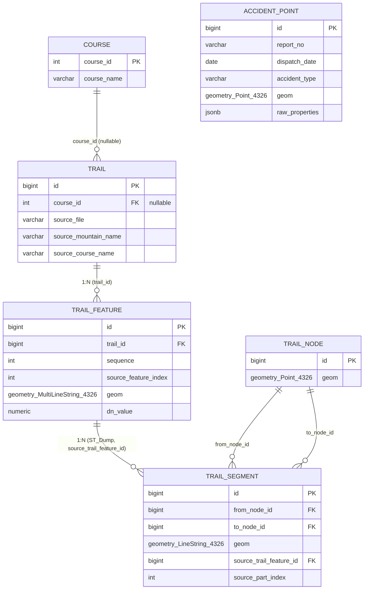
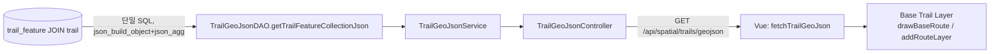
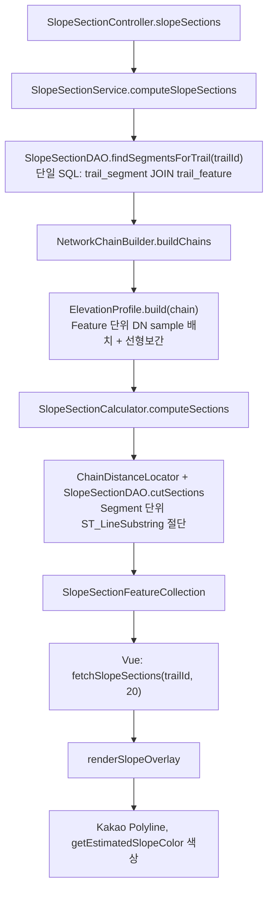
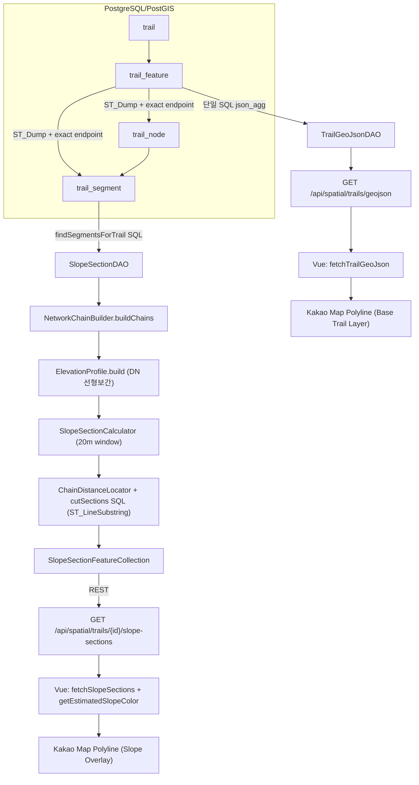

# PostGIS Hiking Trail Network Architecture

> 이 문서는 코드(`backend/src/main/java`, `backend/src/main/resources/db/postgis/*.sql`,
> `backend/src/main/resources/mapper/*.xml`), 실제 실행 중인 PostgreSQL/PostGIS DB
> (`information_schema`/`pg_catalog`/`geometry_columns` 및 실제 row 조회), Frontend 소스
> (`frontend/src/api/slopeSection.js`, 4개 slope 화면)를 직접 읽고 조회해서 작성했다. 추측이나
> 일반론은 넣지 않았고, 코드로 확인되지 않은 부분은 "확인되지 않음"으로 명시했다. DB 조회는
> 전부 read-only(`SELECT`)만 사용했고, Import/Network Build/Accident Import는 재실행하지
> 않았다.

## 1. 전체 구조 요약

```text
Original GeoJSON(정적 파일, 1719 Features)
        ↓ Manifest 기반 분류 + 구조 검증 (Phase 5, TrailImportService)
trail / trail_feature   (Validated Raw Spatial Layer, 1706 Features)
        ↓ ST_Dump + exact endpoint matching (Phase 6, NetworkBuildService)
trail_node / trail_segment   (Derived Network Layer, 2526 / 2122)
        ↓ Java 그래프 재구성 (Phase 12B/12C, NetworkChainBuilder)
NetworkChain (branch-free 연결 단위) + ElevationProfile (DN 선형보간)
        ↓ 고정거리(20m) 윈도우 절단 (SlopeSectionCalculator)
SlopeSection → GeoJSON FeatureCollection
        ↓ REST API
Vue Frontend (Base Trail Layer + Slope Overlay Layer)
        ↓
Kakao Maps Polyline
```

세 개의 계층이 명확히 분리되어 있다: **원본 보존(Raw)** → **파생 위상 구조(Network)** →
**서비스별 파생 분석 단위(SlopeSection, 저장하지 않음)**. 각 계층은 서로 다른 이유로 존재하며
(3번, 6번 참고), 저장하지 않고 매 요청마다 계산하는 계층(SlopeSection)과 DB에 영속화된
계층(trail_feature/trail_node/trail_segment)이 명확히 구분된다.

## 2. 기존 GeoJSON 구조

`frontend/public/data/인왕산ele copy.geojson`(1719 Features)이 원본이다. 구조:

```json
{
  "type": "FeatureCollection",
  "features": [
    {
      "type": "Feature",
      "properties": { "PMNTN_NM": "마루", "DN": 116 },
      "geometry": { "type": "MultiLineString", "coordinates": [[[lon, lat], ...], ...] }
    }
  ]
}
```

- 좌표는 순수 2D `[lon, lat]` — Z(고도) 차원이 원본 GeoJSON에도 없다.
- `DN`은 코스 전체가 아니라 **Feature 하나당 하나의 숫자**로, 이 값의 실제 생성 과정(DEM
  intersect 등)은 `[사용자 제공 전제]`로만 남아있고 repository 내부에서 그 생성 스크립트나
  과정을 증명하는 근거는 발견되지 않았다(이전 Phase 12A 분석에서 전체 재검색 완료, 재확인
  결과 동일).
- Feature 하나가 실제로는 여러 개의 분리된 LineString을 담은 `MultiLineString`인 경우가
  많다(예: 도로/등산로가 물리적으로 끊긴 구간을 한 Feature로 묶어 표현).
- 이 정적 파일은 **지금도 Runtime에서 완전히 삭제되지 않았다** — 아래 §7/§9에서 실제 호출
  경로를 코드로 추적한다.

## 3. PostGIS 데이터 모델

새로 만든 스키마는 `backend/src/main/resources/db/postgis/`에 3개 파일로 나뉘어 있다:

| 파일 | 계층 | 비고 |
|---|---|---|
| `spatial-schema.sql` | Validated Raw Layer (`trail`, `trail_feature`) | 원본 GeoJSON을 그대로 보존 |
| `network-schema.sql` | Derived Network Layer (`trail_node`, `trail_segment`) | `trail_feature`에서 파생, 언제든 재생성 가능 |
| `accident-schema.sql` | Accident Raw Layer (`accident_point`) | 등산로 계층과 완전히 독립적인 원본 |

세 파일의 `DROP` 문이 서로의 테이블을 건드리지 않도록 명시적으로 분리돼 있다(스키마 파일
자체의 주석에 "이 파일은 오직 이 테이블만 DROP한다"고 명기됨) — 계층 간 삭제/재생성이
서로에게 영향을 주지 않게 하려는 설계 의도다.

## 4. 실제 테이블 구조 (코드 정의 vs 실제 DB, 두 값 모두 확인·일치)

아래는 `\d <table>` + `information_schema.geometry_columns` 조회로 실측한 결과이며, DDL
파일의 정의와 완전히 일치함을 확인했다.

### `trail`
```text
id BIGINT PK (identity)
course_id INTEGER NULL, FK → course(course_id) ON DELETE SET NULL
source_file VARCHAR(255) NOT NULL
source_mountain_name VARCHAR(50) NOT NULL
source_course_name VARCHAR(50) NOT NULL
UNIQUE(source_file, source_course_name)
```
- 하나의 등산로 코스를 나타내는 최상위 엔티티. **geometry 컬럼이 없다** — 전체 코스 모양이
  필요하면 `trail_feature`를 쿼리 시점에 조합한다(`spatial-schema.sql` 주석에 실제 조합
  SQL 예시가 있음: `ST_Dump`로 먼저 flatten한 뒤 `ST_LineMerge(ST_Collect(...))`, MultiLineString
  row를 그대로 Collect하면 GEOMETRYCOLLECTION이 되어 `ST_LineMerge`가 빈 결과를 반환하기
  때문).
- `course_id`가 nullable인 이유: `trail`은 `course`의 하위 객체가 아니라 GeoJSON 파일에서
  독립적으로 식별된 소스 체인이고, 실제 DB에서도 마루(trail.id=10)는 `course_id`가
  비어 있다(아래 §8 실측 참고) — "이름이 같다고 자동으로 연결하지 않는다"는 설계가 실제
  데이터에도 반영돼 있다.

### `trail_feature`
```text
id BIGINT PK (identity)
trail_id BIGINT NOT NULL, FK → trail(id) ON DELETE CASCADE
sequence INTEGER NOT NULL           -- 코스 내 의도된 순서(Import 시 검증/부여)
source_feature_index INTEGER NOT NULL  -- 원본 GeoJSON features[] 배열의 원래 인덱스
geom geometry(MultiLineString, 4326) NOT NULL
dn_value NUMERIC NOT NULL
UNIQUE(trail_id, sequence), UNIQUE(trail_id, source_feature_index)
GiST index: idx_trail_feature_geom
```
- **원본 GeoJSON Feature 1개 = `trail_feature` 1 row, 1:1 그대로 보존**(geometry type도
  원본과 동일한 MultiLineString). `sequence`와 `source_feature_index`를 별도로 두는 이유는
  전자가 "의도된 코스 순서"(Import 검증 후 부여), 후자가 "원본 파일에서의 원래 위치"(추적용)
  로 서로 다른 목적이기 때문 — 오늘 데이터에서는 두 값이 우연히 일치하지만 개념적으로 같은
  것이 아니다(`mapper-trail-geojson.xml` 주석에 명시).
- `dn_value`는 원본 `properties.DN`을 타입만 변환해 그대로 저장한 것이지 고도/경사 의미가
  부여된 것이 아니다(스키마 주석에 명시).

### `trail_node`
```text
id BIGINT PK (identity)
geom geometry(Point, 4326) NOT NULL
GiST index: idx_trail_node_geom
```
- 실측: `coord_dimension = 2`, `ST_Z(geom)`은 모든 row에서 빈 값 — **Point이지 PointZ가
  아니다. Z(고도) 값은 여기 없다.**
- `trail_id`, `node_type`(ENDPOINT/JUNCTION) 컬럼이 의도적으로 없다 — 특정 Trail 소속은
  `trail_segment → source_trail_feature_id → trail_feature.trail_id`로 항상 파생 가능하고,
  degree(연결 차수)도 `trail_segment`를 세면 항상 다시 구할 수 있어 캐시하면 재빌드 시
  값이 stale해질 위험만 생긴다는 것이 스키마 주석의 설계 근거.

### `trail_segment`
```text
id BIGINT PK (identity)
from_node_id BIGINT NOT NULL, FK → trail_node(id)
to_node_id BIGINT NOT NULL, FK → trail_node(id)
geom geometry(LineString, 4326) NOT NULL
source_trail_feature_id BIGINT NOT NULL, FK → trail_feature(id) ON DELETE CASCADE
source_part_index INTEGER NOT NULL
CHECK(from_node_id <> to_node_id)
UNIQUE(source_trail_feature_id, source_part_index)
GiST index: idx_trail_segment_geom
btree index: idx_trail_segment_from_node, idx_trail_segment_to_node
```
- `trail_feature.geom`(MultiLineString)을 `ST_Dump`로 분해한 **개별 LineString Part 하나
  = `trail_segment` 1 row**. 두 끝점이 **정확히 좌표가 일치하는 경우에만**(tolerance/snapping
  없음) 같은 `trail_node`로 묶인다.
- `sequence`, `trail_id`, `direction` 컬럼이 없는 이유가 스키마 주석에 명시돼 있다: 순서는
  "원본 파일 순서"이지 "네트워크 그래프 구조"가 아니고, `trail_id`는 파생 가능해 중복
  저장이 오류 위험만 늘리며, 원본에 일방통행을 나타내는 속성이 없어 모든 edge를
  양방향으로 취급한다(from/to는 원본 LineString의 좌표 순서 보존 목적일 뿐).
- 거리(`distance_m`)도 저장하지 않는다 — `ST_Length(geom::geography)`로 항상 다시 계산
  가능하고 geometry가 생성 후 변하지 않기 때문(스키마 주석).

### `accident_point`
```text
id BIGINT PK (identity)
source_file VARCHAR(255) NOT NULL
source_feature_index INTEGER NOT NULL
report_no VARCHAR(50) NOT NULL
dispatch_date DATE NOT NULL
accident_type VARCHAR(50) NOT NULL
location_name VARCHAR(50) NOT NULL
geom geometry(Point, 4326) NOT NULL
raw_properties JSONB NOT NULL
UNIQUE(source_file, source_feature_index)
```
- 등산로 네트워크와 **FK로 연결돼 있지 않다.** 스키마 주석의 근거: 42건 전부 최근접
  Segment와 2번째로 가까운 Segment의 거리 차이가 5m 미만(Segment 중앙값 길이 ~3m라 매우
  촘촘함) — "가장 가까운 것 하나"를 FK로 영구 고정하면 임의의 선택을 고정하는 셈이고,
  `trail_segment`는 재생성 가능한 Derived 데이터라 FK 대상으로 부적절하다. 대신 질의
  시점에 `ST_DWithin`/`ST_Distance`로 관계를 계산한다(§10 아래 별도 API, 이번 분석
  범위인 slope-sections API와는 다른 API).
- 원본 속성 ~65개 중 4개만 컬럼으로 뽑고 나머지는 `raw_properties`(JSONB)에 통째로
  보존 — 42-row 데이터셋을 과도하게 정규화하지 않기 위한 선택(스키마 주석).

### `course` (참고 — 등산로 네트워크와 별개인 기존 비즈니스 테이블)
```text
course_id INTEGER PK, course_name, mountain_id(VARCHAR, mountain 테이블에 대한 진짜 FK 아님),
course_rate, course_location, course_content, distance(VARCHAR), duration(VARCHAR),
course_level, image, video, course_lat/course_lon(단일 대표 좌표)
```
`trail.course_id`가 이 테이블을 참조하지만, `course` 자체는 이번 공간 데이터 리팩터링과
무관하게 이미 존재하던 서술형 비즈니스 테이블이다(geometry 컬럼 없음, `distance`가
문자열 `"3.2km"`).

## 5. ERD



`ACCIDENT_POINT`는 다른 테이블과 FK 관계가 없어 위 ERD에서 독립 개체로만 표시했다(§4 근거).

```text
Course 1개(선택적)
 └─ Trail 0~N개 (course_id로 연결, nullable)

Trail 1개
 └─ TrailFeature N개 (원본 GeoJSON Feature 1:1 보존)

TrailFeature 1개
 └─ TrailSegment 1~N개 (ST_Dump로 분해된 개수만큼 — 실측: 1450개 Feature는 1개, 최대 10개까지 분해된 Feature도 있음)

TrailSegment 1개
 ├─ From Node 1개
 └─ To Node 1개

TrailNode 1개
 └─ 그 node를 참조하는 TrailSegment가 1개(끝점)이거나 2개(통과점) — 실측: 이 데이터셋엔 3개 이상(분기)이 하나도 없음
```

## 6. Trail / Feature / Node / Segment 관계 — 서로 다른 추상화 수준

```text
Trail            = "인왕산 무악동구간" 같은 하나의 코스 식별자. geometry 없음. 최상위 논리적 단위.
TrailFeature     = 원본 GeoJSON 파일의 Feature 하나. Raw 데이터 보존 단위. 실제 네트워크 교차점과
                   무관하게 원본 파일이 자른 경계를 그대로 가짐(원본 export 방식의 artifact).
TrailSegment     = TrailFeature.geom을 ST_Dump로 분해한 LineString Part 하나 + 정확 좌표
                   일치 기준으로 묶인 양 끝 Node. "네트워크 위상(topology)"을 표현하는 단위.
TrailNode        = 여러 Segment가 만나는(또는 끝나는) 점. geometry만 있고 어느 Trail 소속인지는
                   저장하지 않음(파생 가능).
```

**원본 LineString Feature vs Network Segment vs Trail — 셋은 서로 다른 개념이다.**

- Feature(=`trail_feature`)는 원본 파일이 "이만큼을 하나의 단위로 export했다"는 사실만
  보존한다 — 실제 지형의 교차점/분기점과 우연히 일치할 수도, 아닐 수도 있다.
- Segment(=`trail_segment`)는 그 Feature를 물리적으로 분해한 뒤(ST_Dump) 실제 좌표
  일치로 재구성한 위상 그래프의 edge다. **Feature 1개 ≠ Segment 1개**라는 사실이 실측으로
  확인돼 있다(1706개 Feature가 2122개 Segment로 분해됨, §8 카디널리티 참고).
- Trail은 이 둘보다 상위에 있는 순수 논리적 묶음(코스 식별자)이며 geometry 자체를
  가지지 않는다.

이 구분이 실제로 왜 필요한가: 만약 Feature=Segment로 취급했다면, 원본 export 경계에서
"실제로는 이어진 길인데 다른 Feature라서 끊긴 것처럼" 네트워크가 잘못 구성됐을 것이다.
분해(`ST_Dump`) + 좌표 재결합(exact endpoint matching) 단계를 거쳐야 실제 위상 그래프를
얻을 수 있다.

## 7. 원본 데이터 Import 및 Network Build

### 7-1. GeoJSON → `trail`/`trail_feature` (Phase 5, `TrailImportService`)

호출 클래스: `com.season.semiproject.spatial.TrailImportService.importTrails(manifest, geoJsonRoot)`
(Controller/API로 노출되지 않음 — `spatial-import` Spring profile 하에서 `SpatialImportRunner`
만 호출하는 배치성 서비스).

흐름(실제 코드 기준):
1. `FeatureClassifier.classify(manifest, geoJsonRoot)` — 원본 GeoJSON의 모든 Feature를 Manifest
   (JSON, 어떤 `PMNTN_NM`이 어느 Trail 정의에 속하는지 명시)와 대조해 `included`/`excluded`/
   `unexpected`로 분류한다. **`unexpected`가 하나라도 있으면 DB write 전에 즉시 예외를 던지고
   Import를 중단한다** — Manifest가 실제 데이터와 항상 일치함을 강제하는 안전장치.
2. `dao.deleteTrailsBySourceFile(...)` — 같은 `source_file`의 기존 Import를 삭제(replace
   전략, `trail_feature`는 `ON DELETE CASCADE`로 같이 삭제).
3. Manifest의 각 Trail 정의마다 `dao.insertTrail(...)`로 `trail` 1 row 생성.
4. 그 Trail에 속한 `included` Feature 각각에 대해:
   - `dn_value` = `properties.get("DN").asDouble()` — 그대로 저장.
   - `geometryJson` = 원본 `geometry` JsonNode를 다시 문자열로 직렬화.
   - `dao.insertTrailFeature(...)` 호출 → 실제 SQL(`mapper-trail-import.xml`):
     ```sql
     INSERT INTO trail_feature (trail_id, sequence, source_feature_index, geom, dn_value)
     VALUES (#{trailId}, #{sequence}, #{sourceFeatureIndex},
             ST_SetSRID(ST_GeomFromGeoJSON(#{geometryJson}), 4326), #{dnValue})
     ```
   **Java는 JTS 등 GIS 객체를 전혀 만들지 않는다** — 원본 GeoJSON geometry 조각을 그대로
   PostGIS의 `ST_GeomFromGeoJSON`에 문자열로 넘겨 DB가 파싱하게 한다.
5. 구조 검증(`GeoJsonFeatureValidator`)은 Feature가 `type=Feature`, `geometry.type=
   MultiLineString`, 각 sub-line ≥2 좌표, 좌표가 한국 영역 bounding box 안, `properties.DN`
   숫자, `properties.PMNTN_NM` 존재를 확인한다 — 이 중 하나라도 실패하면 Manifest의 명시적
   제외 사유와 매칭되지 않는 한 Import 전체가 실패한다.

**결론(§16 원칙대로 사실만 기록)**: 원본 1719 Feature 중 1706개가 위 과정을 통과해
`trail_feature`가 됐다(13개 제외 — Manifest 기반 명시적 분류, 구체적 사유는 이번 분석에서
DB/코드로 직접 재확인하지 않고 기존 문서(`docs/02`)의 기록을 그대로 인용함을 밝힌다).

### 7-2. `trail_feature` → `trail_node`/`trail_segment` (Phase 6, `NetworkBuildService`)

호출 클래스: `com.season.semiproject.spatial.network.NetworkBuildService.buildNetwork()`
(마찬가지로 API 미노출, `spatial-network-build` profile 전용). 3단계 SQL(`mapper-network-build.xml`):

```sql
-- 1) 분해: 모든 trail_feature.geom(MultiLineString)을 개별 LineString Part로 flatten
CREATE TEMP TABLE tmp_line_part AS
SELECT tf.id AS trail_feature_id, tf.trail_id,
       (ST_Dump(tf.geom)).path[1] AS part_index,
       (ST_Dump(tf.geom)).geom AS geom
FROM trail_feature tf

-- 2) node 생성: 모든 Part의 시작점+끝점 좌표 중 "정확히 같은 좌표"만 GROUP BY로 dedup
INSERT INTO trail_node (geom)
SELECT pt FROM (
    SELECT ST_StartPoint(geom) AS pt FROM tmp_line_part
    UNION ALL
    SELECT ST_EndPoint(geom) AS pt FROM tmp_line_part
) e
GROUP BY pt

-- 3) segment 생성: 각 Part를 그 양 끝점에 해당하는 node에 연결
INSERT INTO trail_segment (from_node_id, to_node_id, geom, source_trail_feature_id, source_part_index)
SELECT sn.id, en.id, lp.geom, lp.trail_feature_id, lp.part_index
FROM tmp_line_part lp
JOIN trail_node sn ON sn.geom = ST_StartPoint(lp.geom)
JOIN trail_node en ON en.geom = ST_EndPoint(lp.geom)
```

**node 생성 방식에 대한 답**:
- LineString의 "모든 좌표"가 아니라 **시작점/끝점만** node가 된다(중간 vertex는 node가
  아니고 `trail_segment.geom` 안에 좌표로만 남는다).
- 교차점을 별도 로직으로 찾지 않는다 — "정확히 같은 좌표가 여러 Part의 끝점으로
  나타나는 지점"이 곧 node이고, `GROUP BY pt`가 dedup을 수행한다(geometry 값이 완전히
  같아야 같은 그룹).
- **tolerance는 0이다** — snapping/거리 기반 병합을 전혀 하지 않는다(스키마/서비스
  주석에 명시, 근접-tolerance 실험은 참고용으로 시도했으나 실제로 채택하지 않았다고
  기록돼 있음).
- `NetworkBuildService.buildNetwork()`는 빌드 후 `segments != lineParts`이면(=어떤 Part의
  끝점이 자기 자신이 만든 node에 매칭되지 않으면, 이론상 불가능해야 함) 예외를 던지고
  트랜잭션을 롤백한다 — silent partial build를 허용하지 않는다.

**segment 생성 방식에 대한 답**:
- 기준: `ST_Dump`가 반환하는 개별 LineString 1개 = Segment 1개. 원본 Feature를 추가로
  더 잘게 쪼개는 로직(mid-line split)은 **없다** — 실제 데이터에 non-endpoint 교차점이
  없었다는 것이 이전 Phase의 분석 결과(이번 세션에서 재검증하지 않음, 기존 기록 인용).
- `from_node → to_node` 구조가 맞다. 두 node가 다르다는 것을 `CHECK` 제약으로 강제한다.
- **segment 순서는 저장하지 않는다** — `source_part_index`는 원본 파일 순서 추적용일
  뿐, 그래프 순회 순서가 아니다(스키마 주석에 명시).
- **양방향**이다 — 원본에 일방통행 정보가 없어 모든 edge가 양쪽으로 순회 가능하다고
  간주한다. `from_node`/`to_node`는 원본 LineString 좌표 순서를 보존할 뿐, "이 방향으로만
  갈 수 있다"는 제약이 아니다.
- `source_trail_feature_id` FK로 원본 Feature와의 관계가 항상 유지된다(`ON DELETE CASCADE`).

## 8. 실제 DB 데이터 예시 (read-only 조회, 민감정보 없음)

### `trail` (전체 4 row)
| id | course_id | source_course_name | source_mountain_name |
|---:|---:|---|---|
| 10 | (NULL) | 마루 | 북한산_백운대 |
| 11 | 3 | 무악동구간 | 인왕산 |
| 12 | 4 | 홍제동구간 | 인왕산 |
| 13 | 2 | 부암동구간 | 인왕산 |

마루(id=10)는 실제로 `course_id`가 비어 있다 — §4에서 설명한 "이름 일치만으로 자동 연결하지
않는다"는 설계가 실제 데이터에도 그대로 반영돼 있음을 확인했다.

### `trail_feature` (예시 3 row)
| id | trail_id | sequence | dn_value | geom_type | npoints | length(m) |
|---:|---:|---:|---:|---|---:|---:|
| 1718 | 10 | 0 | 116 | MultiLineString | 6 | 20.03 |
| 1719 | 10 | 1 | 117 | MultiLineString | 13 | 32.93 |
| 1720 | 10 | 2 | 118 | MultiLineString | 6 | 17.19 |

### `trail_node` (예시 3 row)
| node_id | X(lon) | Y(lat) | Z |
|---:|---:|---:|---|
| 2527 | 127.0006324 | 37.6565938 | (없음) |
| 2528 | 126.9962690 | 37.6525689 | (없음) |
| 2529 | 126.9949489 | 37.6504586 | (없음) |

`ST_Z(geom)`이 모든 row에서 빈 값 — **Z(고도)는 여기 없다.** 고도로 취급되는 값은 오직
`trail_feature.dn_value`뿐이며, 그마저도 §2에서 언급한 대로 물리적 의미가 검증되지 않았다.

### `trail_segment` (예시 3 row)
| segment_id | from_node | to_node | source_feature_id | geom_type | points | length(m) |
|---:|---:|---:|---:|---|---:|---:|
| 2123 | 4502 | 4874 | 2981 | LineString | 2 | 0.72 |
| 2124 | 4747 | 2620 | 2981 | LineString | 3 | 6.26 |
| 2125 | 4874 | 2956 | 2982 | LineString | 3 | 6.83 |

첫 두 row가 같은 `source_feature_id`(2981)를 공유 — 하나의 Feature가 2개 이상 Segment로
분해된 실제 사례(§6에서 설명한 "Feature ≠ Segment"가 데이터로 확인됨).

### `accident_point` (예시 3 row)
| id | report_no | dispatch_date | accident_type | location_name |
|---:|---|---|---|---|
| 14171 | 20231103201R00037 | 2023-01-15 | 사고부상 | 부암동 |
| 14172 | 20231103201R00047 | 2023-01-21 | 사고부상 | 옥인동 |
| 14173 | 20231103104R00062 | 2023-02-17 | 사고부상 | 구기동 |

### 카디널리티/구조 실측
```text
Feature 1개당 Segment 개수 분포:
  1개  → 1450 Features
  2개  → 190
  3개  → 32
  4개  → 11
  5개  → 8, 6개 → 5, 7개 → 4, 8개 → 2, 9개 → 2, 10개 → 2

TrailNode degree 분포 (실측):
  degree 1(끝점) → 808개
  degree 2(통과점) → 1718개
  degree 3 이상(분기) → 0개  ← 이 데이터셋에는 실제로 분기점이 없다
```

## 9. Trail Base Layer 조회 흐름

`GET /api/spatial/trails/geojson` — 4개 slope 화면 포함 다수 화면이 사용하는 "전체 경로
표시" API.



실제 SQL(`mapper-trail-geojson.xml`, 발췌):
```sql
SELECT json_build_object(
  'type', 'FeatureCollection',
  'features', COALESCE(json_agg(
    json_build_object(
      'type', 'Feature',
      'properties', json_build_object('PMNTN_NM', t.source_course_name, 'DN', tf.dn_value),
      'geometry', ST_AsGeoJSON(tf.geom, 15)::json
    ) ORDER BY tf.source_feature_index
  ), '[]'::json)
)::text
FROM trail_feature tf JOIN trail t ON t.id = tf.trail_id
```
- **단일 쿼리**로 1706개 Feature 전체를 하나의 JSON 문자열로 만든다(N+1 없음, Java에서
  row별 조립 없음).
- `TrailGeoJsonController`는 이 문자열을 Jackson으로 재직렬화하지 않고 `ResponseEntity<String>`
  으로 그대로 반환한다(이중 직렬화로 인한 문자열-안의-JSON 문제 방지).
- Frontend: `src/api/slopeSection.js`의 `fetchTrailGeoJson()` → `fetch('/api/spatial/trails/geojson')`.
  4개 slope 화면의 `processGeoJSON(geojsonData, targetMap)`이 `properties.PMNTN_NM`으로
  코스를 필터링해 `drawBaseRoute()`로 녹색 기본 경로를 그린다.
- **원본 정적 GeoJSON은 이 API 경로에서 전혀 쓰이지 않는다** — 4개 slope 화면 코드를
  직접 확인한 결과 `loadGeoJSONFromServer()`가 이제 `fetchTrailGeoJson()`을 호출하도록
  Phase 12D에서 교체됐다. 정적 파일 자체는 삭제되지 않고 Trail Import의 원본 소스/
  Legacy 회귀 검증용으로만 repository에 남아 있다(§13에서 재확인).

## 10. Slope Overlay 조회 흐름

`GET /api/spatial/trails/{trailId}/slope-sections?windowMeters=20`



## 11. 경사도 계산 로직

### 11-1. DB 조회 (단일 SQL, `mapper-slope-section.xml`)
```sql
SELECT
    ts.id AS segmentId, ts.from_node_id AS fromNodeId, ts.to_node_id AS toNodeId,
    ST_Length(ts.geom::geography) AS lengthMeters,
    ts.source_trail_feature_id AS sourceTrailFeatureId,
    tf.dn_value AS sourceDn,
    ST_AsGeoJSON(ts.geom, 9) AS geometryGeoJson
FROM trail_segment ts JOIN trail_feature tf ON tf.id = ts.source_trail_feature_id
WHERE tf.trail_id = #{trailId}
```
- `ST_Length(geom::geography)`로 **실제 지리 거리(m)**를 구한다(평면 좌표 거리 아님).
- Z값은 여기 없으므로 `ST_Z`를 쓰지 않는다 — 고도는 `tf.dn_value`(TrailFeature 컬럼)에서만
  가져온다.
- `ST_DumpPoints`는 이 쿼리에서 사용하지 않는다(Segment는 이미 `trail_segment` 1 row = 1
  LineString이라 추가 분해가 필요 없음).
- SQL 결과 → `TrailSegmentElevationRow`(MyBatis auto-mapping, alias가 camelCase 필드명과
  일치)로 매핑된다. Trail 전체를 **한 번의 쿼리**로 가져온다(Segment마다 개별 쿼리하지
  않음 = N+1 없음).

### 11-2. Java: Network Chain 재구성 (`NetworkChainBuilder`)
DB에서 가져온 `TrailSegmentElevationRow` 목록으로 그래프를 만들고, degree≠2인 node(끝점/
분기점, 이 데이터셋엔 분기 없음)를 경계로 branch-free한 연속 구간(`NetworkChain`)을
walk한다. 방향은 "더 작은 node id가 시작"으로 항상 정규화한다(재현성 확보).

### 11-3. Java: 고도 프로파일 (`ElevationProfile`)
- 한 Chain에 속한 Segment들을 `sourceTrailFeatureId`로 그룹핑해 **Feature당 1개**의 DN
  sample을 만든다(같은 Feature가 여러 Segment로 쪼개져도 sample은 중복 생성하지 않음).
- sample 위치 = 그 Feature 소속 Segment들의 `[최소 누적거리, 최대 누적거리]` 구간의
  중점.
- 두 sample 사이는 **선형 보간**한다. **커버리지 밖으로는 절대 외삽하지 않는다.**

### 11-4. Java: 고정거리 절단 (`SlopeSectionCalculator`)
- `windowMeters=20`의 의미: 고도 프로파일이 정의된 범위 안에서 **20m씩 겹치지 않게** 자른
  구간 하나가 SlopeSection 1개다(10/20/30만 허용, API에서 검증).
- 마지막 남는 자투리 구간은 20m의 절반(10m) 이상이면 `PARTIAL_SECTION`으로 포함, 미만이면
  버린다.
- 계산할 수 없는 구간(sample 2개 미만 등)은 **0%로 채우지 않고 아예 생성하지 않는다.**

### 11-5. 실제 경사 공식 (`SlopeSectionResult` 생성자, 코드 그대로)
```java
this.estimatedElevationDelta = estimatedElevationEnd - estimatedElevationStart;
this.estimatedSlopePercent = (this.estimatedElevationDelta / this.distanceMeters) * 100.0;
```
즉:
```text
estimatedSlopePercent = (estimatedElevationEnd - estimatedElevationStart) / distanceMeters × 100
```
**일반적인 percent-grade 공식**이다 — Legacy(Frontend 옛 코드)의
`Δheight / sqrt(horizontal² + Δheight²) × 100`(대각선 거리로 나눔)과는 다른 공식이다.
"slope degree"(각도, atan 등)는 코드 어디에도 구현돼 있지 않다 — **degree 단위 변환은
없다.**

### 11-6. 색상/등급 (`frontend/src/api/slopeSection.js`)
```js
if (estimatedSlopePercent > 40) return '#FF4500';   // 상승(급)
if (estimatedSlopePercent < -40) return '#1E90FF';  // 하강(급)
return '#32CD32';                                    // 완만
// 숫자가 아니거나 NaN/Infinity 등 non-finite면 null 반환 → Overlay 자체를 그리지 않음
```
- 3단계뿐이며 "완만/보통/급경사" 같은 3단계 이상 등급 체계는 **구현돼 있지 않다.**
- `±40%`는 실제 20m 데이터 분포(|slope| p90 근사치)에서 고른 **presentation rule**이며
  객관적 등산 난이도 기준이라고 코드/문서 어디에도 주장하지 않는다.
- invalid(undefined/null/NaN/Infinity) 입력은 `null`을 반환해 Frontend가 그 Feature의
  Overlay Polyline 자체를 생성하지 않도록 처리한다(가장 최근 수정 사항, "계산 불가"와
  "0%에 가까움"을 혼동하지 않기 위함).

## 12. 전체 End-to-End Flow



## 13. 기존 구조 vs PostGIS 구조

| 구분 | 기존(정적 GeoJSON) | 현재(PostGIS) |
|---|---|---|
| 데이터 원본 | `frontend/public/data/*.geojson` 정적 파일 | `trail`/`trail_feature`/`trail_node`/`trail_segment` (PostgreSQL) |
| Geometry 관리 | 파일 내부 좌표 배열 | `geometry` 컬럼(GiST 인덱스) |
| 데이터 관계 | Feature 목록(평면적) | Trail → Feature → Segment/Node 계층 + FK |
| 경사 계산 입력 | 클라이언트가 fetch한 좌표 배열을 화면마다 임의 개수(5/7/12)로 청킹 | 서버가 Network Chain을 재구성해 고정거리(20m)로 계산 |
| 공간 조회 | 없음(Frontend가 배열을 순회/필터) | `ST_DWithin`/`ST_Length`/`ST_LineSubstring` 등 PostGIS 함수 활용 |
| 클라이언트 일관성 | 화면마다 다른 groupSize → 다른 결과 | 모든 클라이언트가 같은 API/같은 windowMeters 사용 |

이번 세션에서 실제로 확인한 실측 근거로만 위 표를 작성했다 — "성능이 N배 빨라졌다" 같은
근거 없는 비교는 넣지 않았다.

### 기술적으로 왜 더 나은 구조인가
- **현재 구현됨**: Feature(원본 export 경계)와 Segment(위상 그래프 edge)를 분리해, 원본
  파일 구조에 종속되지 않는 네트워크 표현을 확보했다(§6). 이는 향후 원본 파일이 다시
  바뀌어도 재-Import만 하면 Network를 재생성할 수 있는 재사용성을 준다.
- **현재 구현됨**: `trail_segment`/`trail_node`에 GiST/btree 인덱스가 있어 공간 조회
  (`accident_point`↔`trail_segment` 근접 질의 등, slope API와는 별개 API)에 PostGIS
  최적화를 활용할 수 있다.
- **현재 구현됨**: 저장 계층(DB)과 API 계층(계산 로직)이 분리돼, 저장된 원본을 훼손하지
  않고 SlopeSection 같은 파생 분석을 자유롭게 추가/수정할 수 있다(compute-on-request,
  DB 스키마 변경 없이 새 분석 단위를 추가한 사례가 이미 실제로 있었다).
- **향후 확장 가능**(현재 미구현): `trail_node`/`trail_segment`가 이미 from/to node 구조의
  그래프이므로, 최단 경로 탐색(Dijkstra/A* 등)을 얹는 것이 데이터 모델 변경 없이
  가능해 보인다 — 단 실제 경로 탐색 알고리즘, 가중치(거리/경사 기반), pgRouting 등의
  라이브러리 통합은 **이번 프로젝트에 전혀 구현돼 있지 않다.**

## 14. 현재 구현의 장점과 한계

**장점(구현됨)**: Raw/Network 계층 분리, Feature≠Segment 구분, FK 기반 무결성(CASCADE로
정합성 보장), compute-on-request로 저장 오염 없이 새 분석(SlopeSection) 추가, 단일 SQL
+ N+1 없는 조회 설계.

**한계(구현 상태 그대로 기록)**:
- Network는 **exact-endpoint 매칭만** 사용한다 — snapping/tolerance/mid-line 분할이
  없어, 좌표가 미세하게 어긋난 실제 교차점은 서로 다른 node로 남을 수 있다.
- `trail_node`/`trail_segment`에 **Z(고도) 정보가 전혀 없다** — 고도는 오직
  `trail_feature.dn_value`뿐이고 그 물리적 의미(실제 DEM 고도인지)는 미검증 상태다.
- Node degree 3 이상(분기)이 이 데이터셋에는 0개라, 분기 처리 로직(`NetworkChainBuilder`
  안에 실제로 존재함)이 **실데이터로는 아직 검증되지 않았다**(단위테스트로만 검증).
- 경로 탐색(라우팅) 기능은 없다 — 현재는 "고정거리 구간별 경사 계산"만 있고, 두 지점
  사이 최단/최적 경로를 구하는 기능은 구현돼 있지 않다.

## 15. 향후 Navigation/Graph 확장 가능성 (구현되지 않음, 가능성만 서술)

`trail_node`(정점) + `trail_segment`(from/to node를 가진 edge)라는 현재 구조는 그래프
탐색 알고리즘을 얹기에 적합한 형태로 보인다 — 예를 들어 두 `trail_node` 사이 최단
경로를 찾거나, 특정 경사 이상 구간을 회피하는 경로를 찾는 기능은 이 데이터 모델
자체를 바꾸지 않고도 그 위에 별도 서비스 레이어로 추가할 수 있을 것으로 판단된다.
**단, 이는 이번 프로젝트에서 검증하거나 구현한 사실이 아니라 현재 스키마 구조를 보고
내리는 설계적 추론이다** — pgRouting 등 실제 라우팅 엔진 통합, 가중치 정의(거리 vs
경사 기반 cost), 다중 경유지 처리 등은 전혀 시도되지 않았다.

## 16. 포트폴리오용 설명

### 한 문장 버전
> 기존 정적 GeoJSON 등산로 데이터를 PostGIS의 Trail-TrailFeature-TrailNode-TrailSegment
> 계층형 공간 모델로 재구성하고, DB에서 재구성한 Network Chain을 기반으로 고정거리(20m)
> 경사 구간을 서버에서 계산해 GeoJSON API로 제공하는 공간정보 백엔드를 구축했습니다.

### 이력서 2~3줄 버전
> - 정적 GeoJSON 파일 기반 등산로 데이터를 PostgreSQL/PostGIS 기반 Trail/TrailFeature
>   (Raw)·TrailNode/TrailSegment(Network) 계층 모델로 재설계
> - Java로 Network Chain을 재구성해 DEM-derived 대표 고도값을 선형보간하고, 20m 고정거리
>   단위로 경사(estimatedSlopePercent)를 계산하는 REST API 구현
> - 기존 Frontend의 화면별 임의 좌표 청킹(5/7/12개) 경사 계산 로직을 제거하고 서버
>   계산 결과를 공통으로 소비하도록 4개 화면 전환

### 포트폴리오 상세 버전
> 등산로 원본 데이터는 GeoJSON Feature 배열로만 존재했고, 경사 시각화는 Frontend가
> 좌표 배열을 화면마다 다른 개수(5/7/12개)로 임의 청킹해 계산하는 구조였습니다. 이 구조는
> 화면마다 결과가 달라지고, 공간 데이터가 애플리케이션 레이어에 갇혀 재사용이 어렵다는
> 문제가 있었습니다.
>
> 이를 해결하기 위해 PostGIS 기반 **공간 데이터 모델링**을 진행했습니다. 원본 GeoJSON
> Feature를 1:1로 보존하는 Raw Layer(`trail`/`trail_feature`)와, `ST_Dump`로 분해한
> LineString Part를 정확한 좌표 일치 기준으로 재연결한 **Network 계층**(`trail_node`/
> `trail_segment`, Node/Segment 구조)을 분리 설계했습니다. Geometry Z 값은 원본에도
> 존재하지 않아, 고도 정보는 별도 속성 컬럼(`dn_value`)으로 Feature 단위에 보존했습니다.
>
> 경사 계산 API는 이 Network를 **compute-on-request**로 재구성합니다 — DB에 저장된
> Segment 그래프를 Java에서 branch-free Chain으로 재조립하고, Feature 단위 고도값을
> Chain의 누적거리 축에 선형보간으로 배치한 뒤, 20m 고정거리 창으로 잘라 경사(%)를
> 계산합니다. 이 결과는 **GeoJSON FeatureCollection**으로 REST API를 통해 제공되고,
> Vue/Kakao Maps 지도 시각화에서 Base Trail Layer 위에 색상 Overlay로 렌더링됩니다.
> 4개의 기존 Frontend 화면이 각자 하던 경사 계산 책임을 서버로 이전해, 모든 클라이언트가
> 동일한 공간 조회 결과를 공유하도록 전환했습니다.

## 17. 면접 예상 질문

각 질문에 대해 **현재 구현으로 답할 수 있는 사실**과 **추가 확인이 필요한 부분**을 구분한다.

**Q1. 왜 GeoJSON 파일을 그대로 쓰지 않고 PostGIS로 옮겼나요?**
- 답 가능: 파일 기반이면 공간 조회(근접 검색 등)를 애플리케이션 코드로 직접 구현해야
  하고, 여러 화면이 각자 파일을 fetch/파싱해 로직이 중복됐다. PostGIS로 옮기면 DB가
  geometry 인덱스(GiST)와 공간 함수를 제공해 조회를 DB에 위임할 수 있다.
- 추가 확인 필요: 실제 서비스 규모에서 파일 방식 대비 정량적 성능 차이는 측정하지
  않았다(이번 프로젝트는 성능 개선이 목표가 아니었음, 기존 문서에도 명시).

**Q2. 왜 LineString 그대로 저장하지 않고 Node/Segment로 분리했나요?**
- 답 가능: 원본 Feature 경계는 실제 지형 교차점과 무관한 export artifact이기 때문에,
  실제 위상(어디서 길이 만나는지)을 알려면 좌표 단위로 재분해·재연결해야 한다(§6/§7-2).
- 추가 확인 필요: 없음 — 코드/스키마 주석으로 명확히 근거가 있다.

**Q3. Node 중복은 어떻게 처리했나요?**
- 답 가능: `GROUP BY` on exact geometry 값으로 동일 좌표를 하나의 node로 dedup했다
  (§7-2 SQL). Tolerance 기반 병합(근접 좌표를 같은 node로 취급)은 적용하지 않았다.
- 추가 확인 필요: 근접-tolerance 실험이 실제로 어떤 파라미터로 시도됐는지는 이번
  세션에서 코드로 재확인하지 않고 기존 문서 기록을 인용했다.

**Q4. 고도 Z 값은 어디에서 가져오나요?**
- 답 가능: **Z 값은 어디에도 없다.** `trail_node`/`trail_segment`/`trail_feature` geometry
  전부 2D(`coord_dimension=2`, `ST_Z`가 빈 값)이며, 고도로 취급되는 유일한 값은
  `trail_feature.dn_value`(원본 GeoJSON `properties.DN`)뿐이다. 이 값의 물리적 의미(실제
  DEM 고도인지)는 미검증 상태로 문서화돼 있다.
- 추가 확인 필요: DN의 원본 생성 과정(DEM intersect 등)에 대한 문서/스크립트가
  repository 내부에 없어 사용자 진술로만 남아있다.

**Q5. 왜 slope 결과를 DB에 저장하지 않고 요청 시 계산하나요?**
- 답 가능: SlopeSection은 원본 데이터(DN, Network)로부터 항상 재계산 가능한 파생값이고,
  window 크기(10/20/30) 후보를 비교·검증하는 단계였기 때문에 스키마를 먼저 고정하지
  않고 계산 로직만으로 검증했다. 현재 API 응답 시간이 수십 ms 수준이라 캐시/영속화의
  필요성이 아직 확인되지 않았다.
- 추가 확인 필요: 실사용 트래픽 규모에서 이 판단이 계속 유효한지는 미검증(향후
  재검토 대상으로 문서화돼 있음).

**Q6. 20m window를 선택한 이유는 무엇인가요?**
- 답 가능: 10/20/30m 세 후보를 실측 비교해, 극단값(짧은 baseline에서 발생하는
  비정상적으로 큰 slope%) 감소와 공간 해상도(구간 개수)/coverage 사이의 균형점으로
  20m을 선택했다(정량 비교 근거가 별도 문서에 있음).
- 추가 확인 필요: 이번 세션에서는 그 비교 수치 자체를 재실행/재검증하지 않고 구현된
  임계값(±40%, windowMeters 허용값 10/20/30)만 코드로 재확인했다.

**Q7. PostGIS 공간 인덱스를 어디에 적용했나요?**
- 답 가능: `trail_feature.geom`, `trail_node.geom`, `trail_segment.geom`에 GiST 인덱스가
  있다(§4 실측 확인). `trail_segment`의 `from_node_id`/`to_node_id`에는 일반 btree
  인덱스가 있다(그래프 순회용).
- 추가 확인 필요: 이 인덱스들이 실제 쿼리 플랜에서 사용되는지(`EXPLAIN ANALYZE`)는
  이번 세션에서 재실행하지 않았다(기존 별도 문서에 이전 측정 기록이 있다고 알고
  있으나 이번 분석 범위에서 재검증하지 않음).

**Q8. 이 구조에서 최단 경로 탐색을 추가한다면 어떻게 확장할 수 있나요?**
- 답 가능: `trail_node`(정점)/`trail_segment`(from/to를 가진 edge)가 이미 그래프 형태라,
  가중치(거리 또는 경사 기반 cost)를 정의하고 그래프 탐색 알고리즘(Dijkstra 등)이나
  pgRouting 같은 라이브러리를 얹는 방향이 가능해 보인다.
- 추가 확인 필요: **이것은 순수 설계적 추론이며 실제로 구현하거나 프로토타입한 적이
  없다.** 가중치 정의, 알고리즘 선택, 성능 검증 모두 미착수.

**Q9. trail_feature와 trail_segment의 차이는 무엇인가요?**
- 답 가능: `trail_feature`는 원본 GeoJSON Feature를 1:1로 보존한 Raw 데이터(MultiLineString,
  1706 rows)이고, `trail_segment`는 그것을 `ST_Dump`로 분해해 실제 좌표 위상으로
  재연결한 Derived Network Edge(LineString, 2122 rows)다. 1개의 Feature가 여러 Segment로
  쪼개질 수 있고(실측: 최대 10개), 이 카디널리티 자체가 "Feature ≠ Segment"의 증거다.
- 추가 확인 필요: 없음 — 실측 데이터와 스키마 FK로 명확히 뒷받침된다.
