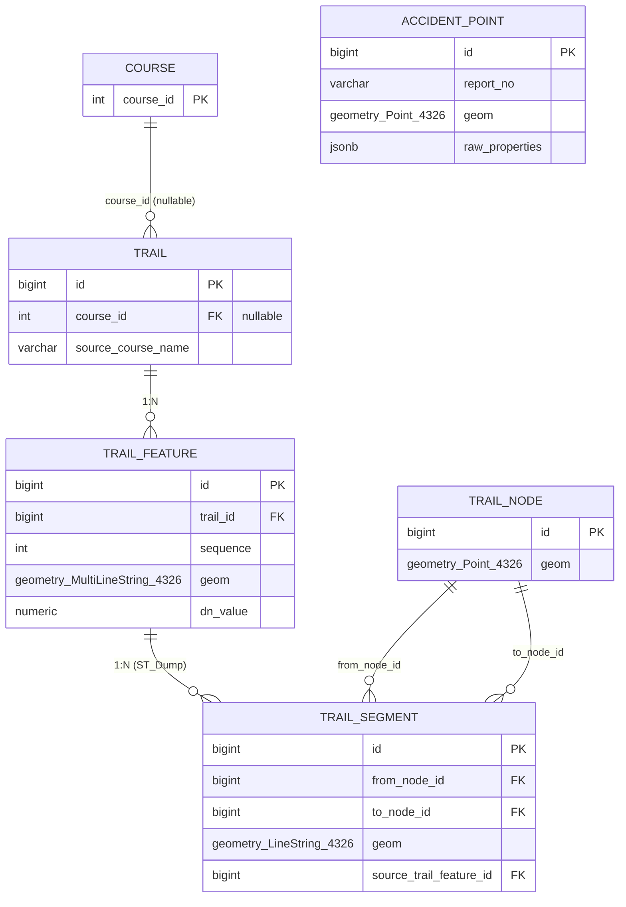
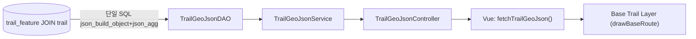
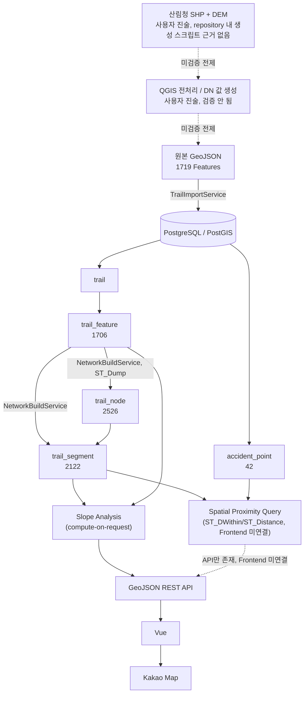

# PostGIS 기반 등산로 공간정보 모델링 및 분석 아키텍처

> 이 문서는 코드(`backend/src/main/java`, `backend/src/main/resources/db/postgis/*.sql`,
> `backend/src/main/resources/mapper/*.xml`), 실행 중인 PostgreSQL/PostGIS(read-only
> `SELECT`/`\d`/`information_schema`/`geometry_columns` 조회), Frontend 소스
> (`frontend/src/api/slopeSection.js`, 4개 slope 화면)를 직접 읽고 검색해서 작성했다.
> 특히 PostGIS 공간 함수는 "있을 것"이라고 가정하지 않고 `backend/src/main/resources/{mapper,db/postgis}`
> 전체에서 `ST_[A-Za-z]+` 패턴으로 전수 검색한 결과만 실었다(§15/§23 참고). 코드로 확인되지
> 않은 내용은 "확인되지 않음"/"향후 확장 가능(미구현)"으로 명확히 구분했다. DB는 read-only
> 조회만 수행했고 Import/Network Build/Accident Import 재실행, 코드/Migration 변경, 파일
> 삭제는 전혀 하지 않았다.

## 1. 리팩터링 배경

기존 등산 안전 플랫폼은 등산로/사고 데이터를 **정적 GeoJSON 파일**로만 관리했다. Frontend
4개 화면(`MountainDetailView.vue`, `CompareCourseView.vue`, `MountainDetailView2.vue`,
`MobileMountainDetailView.vue`)이 각자 `/data/인왕산ele copy.geojson`을 직접 fetch해
좌표를 펼쳐 그리고, 경사 색상은 좌표 배열을 화면마다 다른 고정 크기(5/7/12개)로 잘라
계산했다. 공간 데이터가 DB에서 구조적으로 관리되지 않았고, 지점 간 공간 관계(근접,
연결)를 계산하려면 애플리케이션 코드가 파일 전체를 매번 읽고 순회해야 했다.

## 2. 기존 GeoJSON 데이터 구조

원본: `frontend/public/data/인왕산ele copy.geojson`(1719 Features, 지금도 삭제되지 않고
Import 소스/Legacy 회귀 검증용으로 repository에 남아있음 — §7/§20에서 재확인).

실제 구조(파일을 직접 확인):
```json
{
  "type": "FeatureCollection",
  "features": [
    {
      "type": "Feature",
      "properties": { "PMNTN_NM": "마루", "DN": 116 },
      "geometry": { "type": "MultiLineString", "coordinates": [[[lon, lat], ...], ...] }
    }
  ]
}
```
- `geometry.coordinates`는 **순수 2차원 `[X, Y]`(경도, 위도)**다 — Z(고도)는 좌표 배열
  안에 없다.
- 고도로 쓰인 값은 `properties.DN`이며 **Feature 하나당 숫자 하나**(좌표마다가 아니다).
- `properties`는 `PMNTN_NM`(코스명)과 `DN` 두 개만 이번 등산로 모델링에 쓰인다.
- 경사도 계산(Legacy)은 **Frontend가 직접** 이 파일을 fetch해서 `properties.DN`과
  좌표를 함께 꺼내 계산했다(`LegacySlopeCalculator.java`가 이 Legacy JS 로직을 Java로
  재현·회귀검증한 클래스로 남아있으나, 프로덕션 API로 노출되지 않는다 — §11에서 재확인).

기존 구조의 한계(코드/설계로 확인되는 것만 기술):
- Feature 간 실제 연결 관계(어디서 길이 만나는지)가 파일 구조에 전혀 표현돼 있지 않다 —
  Feature 경계는 원본 export 방식의 artifact일 뿐 실제 교차점과 무관할 수 있다(§6).
- "이 지점 주변의 다른 지점"을 찾으려면 애플리케이션이 전체 좌표를 순회하며 직접
  거리를 계산해야 한다 — 공간 인덱스를 전혀 활용할 수 없다.
- 화면마다 파일을 각자 fetch/파싱해 동일 로직이 중복됐고, 좌표를 청킹하는 크기(5/7/12)가
  화면마다 달라 같은 지점이 화면에 따라 다른 색으로 렌더링됐다(실측 근거: `docs/04`,
  `docs/09`에 기록된 groupCoordinates 회귀 비교).

## 3. PostgreSQL/PostGIS 전환

### Geometry 타입 (실제 DB 조회 결과)
```text
trail_feature.geom : geometry(MultiLineString, 4326)
trail_node.geom     : geometry(Point, 4326)
trail_segment.geom  : geometry(LineString, 4326)
accident_point.geom : geometry(Point, 4326)
```
`geometry_columns` 조회 결과 전부 `coord_dimension = 2`, `srid = 4326` — **PointZ/LineStringZ는
어디에도 없다.** `ST_Z(trail_node.geom)`을 실제로 실행하면 모든 row에서 빈 값이 반환된다.

### Spatial Index (실제 DB `\d` 조회 결과)
| 테이블 | 인덱스 | 종류 |
|---|---|---|
| `trail_feature` | `idx_trail_feature_geom` | GiST |
| `trail_node` | `idx_trail_node_geom` | GiST |
| `trail_segment` | `idx_trail_segment_geom` | GiST |
| `trail_segment` | `idx_trail_segment_from_node`, `idx_trail_segment_to_node` | btree (그래프 순회용) |
| `accident_point` | (geometry 인덱스 없음) | — |

`accident_point`는 42건 규모라 GiST를 추가하지 않았다는 설계 판단이 스키마 주석에 명시돼
있다.

### 실제 사용 중인 PostGIS 함수 (전수 검색 결과, 추측 없음)

`backend/src/main/resources/{mapper,db/postgis}` 전체에서 `ST_[A-Za-z]+` 패턴으로
검색한 **정확한 전체 목록**:

```text
ST_AsGeoJSON, ST_Collect*, ST_DWithin, ST_Distance, ST_Dump, ST_EndPoint,
ST_GeomFromGeoJSON, ST_GeomFromText, ST_Length, ST_LineMerge*, ST_LineSubstring,
ST_MakePoint, ST_SetSRID, ST_Split**, ST_StartPoint
```
`*` = **실제 실행되는 쿼리가 아니라 SQL 주석 안의 예시 패턴**(`spatial-schema.sql`,
"전체 코스 모양이 필요하면 이렇게 조합할 수 있다"는 참고용 설명 — 실제로 이 SELECT를
실행하는 DAO 메서드는 코드 전체에 존재하지 않는다).
`**` = 코드 주석에 **"사용하지 않는다"고 명시적으로 기록된** 함수(실제 데이터에 mid-line
교차점이 없어 mid-line split이 필요 없었다는 설명).

**중요 — 문서 작성 전 가정과 실제 코드가 다른 부분**: `ST_Within`, `ST_Intersects`,
`ST_ClosestPoint`, `ST_Transform`, `ST_X`, `ST_Y`, `ST_Z`, `ST_NPoints`, `ST_AsText`,
`ST_GeometryType`, `ST_DumpPoints`, `ST_LineLocatePoint`, `ST_LineInterpolatePoint`는
**코드 전체에 단 한 곳도 존재하지 않는다.** (이 문서의 §8/§9의 표에 있는 `ST_X`/`ST_Y`/`ST_Z`
값은 이번 분석을 위해 필자가 직접 실행한 **read-only 조회 전용 psql 명령**이며, 애플리케이션
코드가 아니다 — 혼동하지 않도록 구분해서 표기했다.)

### 실제 함수별 사용처
| 함수 | 사용처(파일) | 목적 |
|---|---|---|
| `ST_GeomFromGeoJSON` + `ST_SetSRID` | `mapper-trail-import.xml` | 원본 GeoJSON geometry 조각을 그대로 `trail_feature.geom`으로 저장 |
| `ST_MakePoint` + `ST_SetSRID` | `mapper-accident-import.xml` | Point인 사고 좌표 저장(GeoJSON 파싱보다 단순) |
| `ST_Dump` | `mapper-network-build.xml` | `trail_feature`의 MultiLineString을 개별 LineString Part로 분해 |
| `ST_StartPoint`/`ST_EndPoint` | `mapper-network-build.xml` | 분해된 Part의 양 끝점 좌표 추출 → Node 후보 |
| `ST_Length(...::geography)` | `mapper-slope-section.xml` | Segment의 실제 지리 거리(m) 계산 |
| `ST_AsGeoJSON` | `mapper-trail-geojson.xml`, `mapper-slope-section.xml` | geometry를 GeoJSON으로 직렬화(API 응답용) |
| `ST_GeomFromText` + `ST_LineSubstring` | `mapper-slope-section.xml` | SlopeSection 경계에서 geometry를 정확히 절단 |
| `ST_DWithin` + `ST_Distance` (둘 다 `::geography`) | `mapper-spatial-query.xml` | AccidentPoint ↔ TrailSegment 근접 관계(§15) |

## 4. 공간정보 데이터 모델

### `trail`
- **목적**: 하나의 등산 코스를 나타내는 논리적 최상위 단위. geometry 컬럼이 없다.

| 컬럼 | 타입 | 의미 |
|---|---|---|
| id | BIGINT PK | 식별자 |
| course_id | INTEGER, nullable FK→course | 비즈니스 `course` 테이블과의 선택적 연결(이름이 같다고 자동 연결 안 함) |
| source_file | VARCHAR(255) | 원본 GeoJSON 파일명 |
| source_mountain_name / source_course_name | VARCHAR(50) | 원본 속성 값 |

### `trail_feature`
- **목적**: 원본 GeoJSON Feature를 **1:1 그대로 보존**하는 Raw Spatial Layer.

| 컬럼 | 타입 | 의미 |
|---|---|---|
| id | BIGINT PK | 식별자 |
| trail_id | BIGINT FK→trail (CASCADE) | 소속 Trail |
| sequence | INTEGER | Import 시 검증·부여된 코스 내 순서 |
| source_feature_index | INTEGER | 원본 파일 features[] 배열의 원래 인덱스 |
| geom | geometry(MultiLineString,4326) | 원본 좌표 그대로 |
| dn_value | NUMERIC | 원본 `properties.DN`, 물리적 의미 미검증 |

공간 컬럼: MultiLineString, SRID 4326, Z 없음, GiST 인덱스 있음.

### `trail_node`
- **목적**: Segment들이 정확히 같은 좌표에서 만나는 지점(위상 그래프의 정점).

| 컬럼 | 타입 | 의미 |
|---|---|---|
| id | BIGINT PK | 식별자 |
| geom | geometry(Point,4326) | 정점 좌표 |

공간 컬럼: Point, SRID 4326, **Z 없음**, GiST 인덱스 있음. `trail_id`/`node_type` 컬럼 없음
— 둘 다 다른 테이블에서 파생 가능해 중복 저장하지 않는다(스키마 주석).

### `trail_segment`
- **목적**: 두 Node를 잇는 위상 그래프의 edge. `trail_feature.geom`을 `ST_Dump`로 분해한
  LineString Part 1개에 대응.

| 컬럼 | 타입 | 의미 |
|---|---|---|
| id | BIGINT PK | 식별자 |
| from_node_id / to_node_id | BIGINT FK→trail_node | 양 끝 정점(CHECK: 서로 달라야 함) |
| geom | geometry(LineString,4326) | 원본 Part 좌표 그대로(재가공 없음) |
| source_trail_feature_id | BIGINT FK→trail_feature (CASCADE) | 파생 원본 Feature |
| source_part_index | INTEGER | `ST_Dump`가 매긴 Part 순번(원본 순서 추적용, 그래프 순회 순서 아님) |

공간 컬럼: LineString, SRID 4326, Z 없음, GiST + from/to node btree 인덱스.

### `accident_point`
- **목적**: 사고 위치를 나타내는 독립 Raw 공간 객체. **등산로 테이블과 FK가 없다.**

| 컬럼 | 타입 | 의미 |
|---|---|---|
| id | BIGINT PK | 식별자 |
| report_no / dispatch_date / accident_type / location_name | 각각 | 65개 원본 속성 중 결측 없는 4개만 컬럼화 |
| geom | geometry(Point,4326) | 사고 좌표 |
| raw_properties | JSONB | 원본 나머지 속성 전체 보존 |

관계: FK 없음. `trail_segment`와는 **질의 시점에 `ST_DWithin`/`ST_Distance`로만** 관계를
계산한다(§15) — 스키마 주석 근거: 42건 전부 최근접/2번째 근접 Segment 거리 차이가 5m
미만(Segment median 길이 ~3m라 매우 촘촘)이라 "가장 가까운 것"을 FK로 영구 고정하면
임의의 선택을 고정하는 셈이 된다.

## 5. ERD


`ACCIDENT_POINT`는 다른 테이블과 FK가 없어 독립 개체로 표시했다.

```text
Trail
 ├─ TrailFeature N개 (원본 Feature 1:1 보존)
 └─ TrailSegment N개
      ├─ From TrailNode 1개
      └─ To TrailNode 1개
```

## 6. Trail / Feature / Node / Segment 모델

- **Trail**: 하나의 등산 코스를 나타내는 **논리적 그룹**. geometry가 없다 — 지도에 그릴
  전체 모양이 필요하면 `trail_feature`를 쿼리 시점에 조합해야 한다.
- **TrailFeature**: 원본 SHP/GeoJSON의 LineString(정확히는 MultiLineString) Feature
  **한 개에 정확히 대응**한다(1:1, 재가공 없이 그대로 저장).
- **TrailNode**: **Feature/Segment의 시작점·끝점만** Node가 된다(중간 vertex는 Node가
  아니다). "정확히 같은 좌표"를 가진 여러 Part의 끝점들이 `GROUP BY` dedup으로 하나의
  Node가 된다 — 교차점을 별도로 탐지하는 알고리즘은 없고, "우연히 좌표가 정확히 같은
  지점"이 곧 교차점으로 취급된다. 고도 변화점 기준의 Node 생성은 없다(고도 자체가
  geometry에 없으므로).
- **TrailSegment**: `ST_Dump`로 분해된 LineString Part 하나와, 그 양 끝점이 해당하는
  TrailNode 두 개를 연결한다. **geometry는 원본 Feature 일부를 그대로 잘라온 것**이지
  새로 계산된 좌표가 아니다.

```text
Node A ───── Segment 1 ───── Node B ───── Segment 2 ───── Node C
```

```text
Trail
  │
  ├── TrailFeature A (geom = MultiLineString, dn_value = 116)
  │      └─ ST_Dump →  Node1 ●────Segment1────● Node2
  │
  └── TrailFeature B (geom = MultiLineString, dn_value = 117)
         └─ ST_Dump →  Node2 ●────Segment2────● Node3
```
(위 예시의 Node2 공유는 개념 설명용이며, 실제 이 데이터셋에서 서로 다른 Feature의 Part가
정확히 같은 좌표로 만나는 실사례가 존재함을 §9에서 실제 row로 보여준다.)

**Feature 1개 ≠ Segment 1개**라는 사실이 실측으로 확인된다: 1706개 Feature가 2122개
Segment로 분해됐다(§9 카디널리티 표).

## 7. 원본 데이터 → PostGIS Import

호출 클래스: `com.season.semiproject.spatial.TrailImportService.importTrails(manifest, geoJsonRoot)`
(Controller/API로 노출되지 않음, `spatial-import` profile 전용 배치 서비스).

```text
원본 GeoJSON(1719 Features)
        ↓ FeatureClassifier.classify(manifest, geoJsonRoot)
included / excluded / unexpected 분류
        ↓ (unexpected가 있으면 DB write 전에 즉시 예외 → Import 중단)
GeoJsonFeatureValidator.validate(feature)  ── 구조 검증
        ↓
dao.insertTrail(...) → trail 1 row
dao.insertTrailFeature(...) → trail_feature 1 row (Feature 1개당)
```
`insertTrailFeature` 실제 SQL(`mapper-trail-import.xml`):
```sql
INSERT INTO trail_feature (trail_id, sequence, source_feature_index, geom, dn_value)
VALUES (#{trailId}, #{sequence}, #{sourceFeatureIndex},
        ST_SetSRID(ST_GeomFromGeoJSON(#{geometryJson}), 4326), #{dnValue})
```
Java는 JTS 등 GIS 객체를 만들지 않는다 — 원본 geometry JSON 조각을 문자열 그대로
PostGIS에 넘겨 DB가 파싱한다. `dn_value`는 `properties.get("DN").asDouble()`로 그대로
가져온다(계산/변환 없음). `GeoJsonFeatureValidator`는 `geometry.type=MultiLineString`,
좌표 개수, 한국 bounding box, `DN`/`PMNTN_NM` 존재 여부를 확인한다.

결과: 원본 1719 Feature 중 1706개가 `trail_feature`가 됐다(13개 제외 — Manifest 기반
명시적 분류. 구체적 제외 사유는 이번 세션에서 DB/코드로 재확인하지 않고 기존
`docs/02` 기록을 인용함을 밝힌다).

## 8. Network Build

호출 클래스: `com.season.semiproject.spatial.network.NetworkBuildService.buildNetwork()`
(`spatial-network-build` profile 전용, API 미노출).

```text
TrailFeature Geometry(MultiLineString)
        ↓ ST_Dump(tf.geom)  →  tmp_line_part 임시 테이블(개별 LineString Part)
좌표 추출: ST_StartPoint / ST_EndPoint (각 Part의 양 끝)
        ↓
Node 후보 생성: 모든 Part의 시작점+끝점을 UNION ALL
        ↓
Node Dedup: GROUP BY pt (geometry 값이 "정확히 같은" 좌표만 하나로 묶임 — tolerance 없음)
        ↓ INSERT INTO trail_node
Segment 생성: 각 Part를 그 시작점/끝점에 해당하는 trail_node에 JOIN으로 연결
        ↓ INSERT INTO trail_segment (from_node_id, to_node_id, geom, source_trail_feature_id, source_part_index)
```
실제 SQL(`mapper-network-build.xml`, 3단계):
```sql
-- Node dedup
INSERT INTO trail_node (geom)
SELECT pt FROM (
    SELECT ST_StartPoint(geom) AS pt FROM tmp_line_part
    UNION ALL
    SELECT ST_EndPoint(geom) AS pt FROM tmp_line_part
) e
GROUP BY pt

-- Segment 생성
INSERT INTO trail_segment (from_node_id, to_node_id, geom, source_trail_feature_id, source_part_index)
SELECT sn.id, en.id, lp.geom, lp.trail_feature_id, lp.part_index
FROM tmp_line_part lp
JOIN trail_node sn ON sn.geom = ST_StartPoint(lp.geom)
JOIN trail_node en ON en.geom = ST_EndPoint(lp.geom)
```

확인된 세부 사항:
- **Node 중복 판단 기준**: geometry 값의 완전 동일성(`GROUP BY pt`) — **tolerance는 0이다**,
  근접-snapping 로직이 전혀 없다.
- **Z값 처리**: 애초에 geometry에 Z가 없으므로 Node/Segment 생성 과정에 Z 처리 자체가
  없다.
- **Feature 경계 처리**: 추가로 더 잘게 쪼개는 mid-line split이 없다 — 실제 데이터에
  non-endpoint 교차점이 없었다는 것이 이전 분석 결과(이번 세션에서 재검증하지 않음).
- **Segment 순서**: 저장하지 않는다(`source_part_index`는 원본 파일 순서 추적용).
- **방향성**: `CHECK(from_node_id <> to_node_id)`만 있고 일방통행 개념이 없다 — 모든
  edge를 양방향으로 취급한다.
- **동일 Node 공유**: 서로 다른 Feature의 Part가 정확히 같은 좌표에서 만나면 같은
  `trail_node`를 공유한다(실제 사례는 §9에서 확인).
- **빌드 안전장치**: `NetworkBuildService.buildNetwork()`는 `segments != lineParts`이면
  예외를 던지고 트랜잭션 전체를 롤백한다 — 불완전한 Network가 부분적으로 저장되는
  경우를 허용하지 않는다.

## 9. 실제 DB 데이터 구조 (read-only 조회 결과)

### 데이터 규모(재확인)
```text
trail            = 4
trail_feature    = 1706
trail_node       = 2526
trail_segment    = 2122
accident_point   = 42
```

### Trail Node (예시 3건, `ST_X`/`ST_Y`/`ST_Z`는 필자가 직접 실행한 분석용 조회)
| node_id | X(lon) | Y(lat) | Z |
|---:|---:|---:|---|
| 2527 | 127.0006324 | 37.6565938 | (없음) |
| 2528 | 126.9962690 | 37.6525689 | (없음) |
| 2529 | 126.9949489 | 37.6504586 | (없음) |

### Trail Segment (예시 3건)
| segment_id | from_node | to_node | length(m) | geometry_type |
|---:|---:|---:|---:|---|
| 2123 | 4502 | 4874 | 0.72 | LineString |
| 2124 | 4747 | 2620 | 6.26 | LineString |
| 2125 | 4874 | 2956 | 6.83 | LineString |

첫 두 row는 같은 `source_trail_feature_id`(2981)를 공유하고, 2123과 2125는 각각
`to_node=4874`/`from_node=4874`로 **같은 Node를 공유**한다 — §6에서 설명한 "다른 Part가
같은 좌표에서 만나면 Node를 공유한다"가 실제 데이터로 확인된 사례다.

### Trail Feature (예시 3건)
| feature_id | trail_id | geometry_type | point_count |
|---:|---:|---|---:|
| 1718 | 10 | MultiLineString | 6 |
| 1719 | 10 | MultiLineString | 13 |
| 1720 | 10 | MultiLineString | 6 |

### Feature→Segment 카디널리티(전수 집계)
```text
Segment 1개로 분해된 Feature : 1450개
Segment 2개                 : 190개
Segment 3~10개               : 66개 (최대 10개)
```

### Node degree 분포(전수 집계)
```text
degree 1(끝점)   : 808개
degree 2(통과점) : 1718개
degree 3 이상(분기) : 0개 ← 이 데이터셋에는 실제 분기점이 없다
```

## 10. Trail Base Layer 조회

`GET /api/spatial/trails/geojson`


실제 SQL(`mapper-trail-geojson.xml`):
```sql
SELECT json_build_object(
  'type', 'FeatureCollection',
  'features', COALESCE(json_agg(
    json_build_object('type','Feature',
      'properties', json_build_object('PMNTN_NM', t.source_course_name, 'DN', tf.dn_value),
      'geometry', ST_AsGeoJSON(tf.geom, 15)::json
    ) ORDER BY tf.source_feature_index
  ), '[]'::json)
)::text
FROM trail_feature tf JOIN trail t ON t.id = tf.trail_id
```
단일 쿼리로 1706개 Feature 전체를 하나의 JSON으로 만든다(N+1 없음). 4개 slope 화면
코드를 직접 확인한 결과 `loadGeoJSONFromServer()`가 이 API(`fetchTrailGeoJson()`)를
호출하도록 돼 있고, **원본 정적 GeoJSON은 이 경로에서 전혀 쓰이지 않는다** — 정적
파일은 삭제되지 않았을 뿐 Import 소스/Legacy 회귀 검증용으로만 repository에 남아있다.

## 11. 경사도 분석 모델

경사 Overlay가 정적 GeoJSON이 아니라 PostGIS Network 데이터를 읽는지 4개 slope 화면
소스코드로 직접 확인했다: `src/api/slopeSection.js`의 `fetchSlopeSections(trailId, windowMeters)`
가 아래 API를 호출하고, 화면들은 이 응답으로 `renderSlopeOverlay()`를 실행한다 — 정적
파일을 읽는 코드 경로는 이 기능에서 완전히 제거됐다(Phase 12D).

```text
GET /api/spatial/trails/{trailId}/slope-sections?windowMeters=20
```

전체 Call Chain(실제 클래스/메서드명):
```text
Vue: fetchSlopeSections(trailId, 20)
    ↓
SlopeSectionController.slopeSections(trailId, windowMeters)
    ↓
SlopeSectionService.computeSlopeSections(trailId, windowMeters)
    ↓
SlopeSectionDAO.findSegmentsForTrail(trailId)  -- 단일 SQL
    ↓
NetworkChainBuilder.buildChains(rows)
    ↓
ElevationProfile.build(chain)   -- Feature 단위 DN sample + 선형보간
    ↓
SlopeSectionCalculator.computeSections(chain, windowMeters)
    ↓
ChainDistanceLocator + SlopeSectionDAO.cutSections(...)  -- ST_LineSubstring 절단
    ↓
SlopeSectionFeatureCollection (GeoJSON)
    ↓
Vue: getEstimatedSlopeColor(estimatedSlopePercent)
    ↓
Kakao Maps Polyline
```

## 12. 경사도 계산 과정

**Step 1. Trail 선택**: Frontend `resolveTrailId(courseName)`이 `course` DB 테이블의
`course_name`("무악동" 등, "구간" 접미사 없음)과 Trail GeoJSON API의 `PMNTN_NM`("무악동구간"
등)이 다르다는 것을 확인하고, 정확히 일치하거나 `PMNTN_NM.includes(courseName)`인 경우
매핑한다(실제 DB 확인: 마루=10, 무악동구간=11, 홍제동구간=12, 부암동구간=13).

**Step 2. Segment 조회**: 단일 SQL로 Trail 전체의 Segment+부모 Feature의 DN을 한 번에
가져온다(§3 함수표, `mapper-slope-section.xml`):
```sql
SELECT ts.id AS segmentId, ts.from_node_id AS fromNodeId, ts.to_node_id AS toNodeId,
       ST_Length(ts.geom::geography) AS lengthMeters,
       ts.source_trail_feature_id AS sourceTrailFeatureId, tf.dn_value AS sourceDn,
       ST_AsGeoJSON(ts.geom, 9) AS geometryGeoJson
FROM trail_segment ts JOIN trail_feature tf ON tf.id = ts.source_trail_feature_id
WHERE tf.trail_id = #{trailId}
```

**Step 3. Node/고도 조회**: **`trail_node`/`trail_segment` geometry에는 Z가 없으므로
Z를 조회하는 코드가 없다.** 고도값은 오직 `tf.dn_value`(TrailFeature 컬럼)에서 온다 —
`trail_node geometry Z`, `segment geometry Z`, `별도 elevation 테이블` 셋 다 아니다.

**Step 4. Network Chain 구성** (`NetworkChainBuilder.buildChains`): degree≠2인 Node
(끝점/분기점 — 이 데이터셋엔 분기 0개)를 경계로 branch-free 연속 구간을 walk한다.
방향은 "더 작은 node id가 시작"으로 정규화한다.

**Step 5. Elevation Profile 생성** (`ElevationProfile.build`): Chain에 속한 Segment들을
`sourceTrailFeatureId`로 그룹핑해 Feature당 1개의 DN sample을 만들고, 그 위치는 해당
Feature 소속 Segment들의 `[최소 누적거리, 최대 누적거리]` 중점이다. 두 sample 사이는
선형 보간하고, 커버리지 밖으로는 외삽하지 않는다 — "거리 0m→Z1, 10m→Z2, ..."식의
등간격 프로파일이 아니라 **Feature 위치마다 불규칙한 간격의 sample point들 사이를
보간하는 구조**다.

**Step 6. Window 기반 경사 계산** (`SlopeSectionCalculator.computeSections`):
`windowMeters=20`은 "고도 프로파일이 정의된 범위 안에서 20m씩 겹치지 않게 자른 구간
하나가 SlopeSection 하나"라는 뜻이다(10/20/30만 허용). 마지막 자투리 구간은 10m
이상이면 `PARTIAL_SECTION`으로 포함, 미만이면 버린다. 실제 공식(`SlopeSectionResult`
생성자 코드 그대로):
```java
estimatedElevationDelta = estimatedElevationEnd - estimatedElevationStart;
estimatedSlopePercent = (estimatedElevationDelta / distanceMeters) * 100.0;
```
일반적인 percent-grade 공식이며, Legacy(대각선 거리로 나눔)와 다르다. **degree(각도)
단위 변환은 코드 어디에도 없다.**

**Step 7. 경사 등급/색상** (`frontend/src/api/slopeSection.js`, `getEstimatedSlopeColor`):
```js
> 40  → '#FF4500' (상승)
< -40 → '#1E90FF' (하강)
그 외  → '#32CD32' (완만)
non-finite(undefined/NaN/Infinity 등) → null → Overlay 생성 안 함
```
"완만/보통/급경사" 3단계 이상 등급 체계는 구현돼 있지 않다 — **2개 threshold, 3색뿐**이다.
`±40%`는 실제 20m 데이터 분포(|slope| p90 근사치)로 고른 presentation rule이며 객관적
난이도 기준이 아니라고 코드/문서에 명시돼 있다.

**Step 8. GeoJSON 생성**: `SlopeSectionFeatureCollection` → 각 Feature의 `properties`는
`chainIndex, sectionIndex, distanceMeters, estimatedElevationStart/End/Delta,
estimatedSlopePercent, dataQualityFlag(null 또는 "PARTIAL_SECTION")`이다(실제 DTO 필드,
`slope`/`grade`라는 필드명은 쓰지 않는다).

**Step 9. Frontend 시각화**: 4개 화면의 `renderSlopeOverlay()`가 응답의 각 Feature마다
`getEstimatedSlopeColor(...)`로 색을 구하고, `null`이면 그 Feature는 건너뛰고(Base Trail만
보임), 아니면 `kakao.maps.Polyline`을 생성해 지도에 추가한다.

## 13. Slope API → 지도 시각화

```mermaid
flowchart LR
    A[(PostGIS Trail Network)] --> B["trail_segment 조회<br/>(findSegmentsForTrail SQL)"]
    B --> C["ElevationProfile<br/>(DN 기반, Z 아님)"]
    C --> D["NetworkChainBuilder<br/>누적거리 축 구성"]
    D --> E["20m Window<br/>(SlopeSectionCalculator)"]
    E --> F["경사도 계산<br/>Δelevation/distance×100"]
    F --> G["색상 분류<br/>±40% threshold, 3색"]
    G --> H[GeoJSON FeatureCollection]
    H --> I["REST API<br/>/slope-sections"]
    I --> J["Vue fetchSlopeSections"]
    J --> K[Kakao Map Polyline]
```



## 14. 사고 위험 Point 모델

`accident_point` 스키마는 §4에서 이미 다뤘다. 핵심 재확인:
```text
accident_point
 ├─ id, source_file, source_feature_index (UNIQUE 쌍)
 ├─ report_no, dispatch_date, accident_type, location_name
 ├─ geom  (Point, SRID 4326, Z 없음)
 └─ raw_properties (JSONB, 원본 65개 속성 보존)
```
42건 전부 원본 GeoJSON(`2023산악사고_인왕산.geojson`) Feature와 1:1(필터링/그룹핑 없음).
등산로 테이블과의 **FK는 없다.**

## 15. PostGIS Spatial Query

**실제 SQL을 확인한 결과, 사고↔등산로 관계는 정확히 `ST_DWithin` + `ST_Distance` 조합만
사용한다. `ST_Within`은 코드 어디에도 없다.**

`mapper-spatial-query.xml`(발췌):
```sql
-- API A: 사고 1건 → distanceMeters 이내의 모든 TrailSegment
SELECT ts.id AS segmentId, ..., ST_Distance(a.geom::geography, ts.geom::geography) AS distanceMeters
FROM accident_point a
JOIN trail_segment ts
    ON ST_DWithin(a.geom::geography, ts.geom::geography, #{distanceMeters})
...
WHERE a.id = #{accidentId}
ORDER BY ST_Distance(a.geom::geography, ts.geom::geography) ASC
```
- **`ST_DWithin`을 쓴 이유**: "특정 거리(m) 이내의 모든 후보"를 찾는 것이 목적이라
  경계 판정(포함관계, `ST_Within`)이 아니라 **반경 검색**이 맞는 연산이기 때문 —
  Trail은 Line이고 Accident는 Point라 애초에 "포함관계(Within)"라는 개념 자체가
  성립하지 않는다(Point가 Line "안에" 있다는 것은 정의상 의미가 다르다).
- **`ST_Distance`를 같이 쓴 이유**: `ST_DWithin`은 참/거짓만 반환하므로, 정렬(가까운
  순)과 화면 표시용 정확한 거리(m) 값을 얻기 위해 별도로 `ST_Distance`를 호출한다.
- **둘 다 `::geography` 캐스트**: 좌표를 평면 degree 거리가 아니라 **실제 지리 거리(m)**로
  계산하기 위함(주석에 명시).
- **공간 인덱스 적용 여부**: `accident_point`에는 GiST가 없다(42건 규모라 불필요 판단,
  §4). `trail_segment.geom`에는 GiST가 있지만, 이 쿼리처럼 `geom::geography`로 캐스트한
  뒤 `ST_DWithin`을 걸면 **원본 geometry GiST 인덱스가 그대로 활용되지 않는다**는 것이
  기존 `EXPLAIN ANALYZE` 분석으로 이미 확인돼 있다(이번 세션에서 재실행하지 않고
  기존 `docs/05` 기록을 인용). 현재 규모(Segment 2122건)에서는 이 Seq Scan 비용이
  무시할 만한 수준이라 별도의 geography 전용 함수형 인덱스는 추가하지 않았다는 판단이
  기존 문서에 남아있다.
- **exhaustive 설계**: 이 두 쿼리는 KNN 연산자(`<->`)로 후보를 먼저 좁히지 않는다 —
  "N미터 이내 전부"를 요구하면서 KNN LIMIT를 걸면 실제로 반경 안에 있는데도 후보
  윈도우 밖이라 누락되는 경우가 생길 수 있기 때문(주석에 명시된 설계 이유).

## 16. 등산로와 사고 위험지역 연결

**현재 실제로 무엇이 구현돼 있는가**를 코드로 확인한 결과:

```text
[현재 구현됨]
- SpatialQueryController가 노출하는 2개 API:
  GET /api/spatial/accidents/{accidentId}/nearby-segments?distanceMeters=N
  GET /api/spatial/trail-segments/{segmentId}/nearby-accidents?distanceMeters=N
- 둘 다 SpatialQueryService → SpatialQueryDAO → 위 ST_DWithin/ST_Distance SQL을 그대로 호출
- distanceMeters는 API 호출자가 매번 지정하는 파라미터이며, "위험 반경"으로 하드코딩된
  고정값이 아니다.

[프론트엔드 연결 상태 — 확인됨]
- frontend/src 전체를 "nearby-segments"/"nearby-accidents" 문자열로 검색한 결과 0건 —
  이 두 API는 **아직 어떤 Frontend 화면에서도 호출되지 않는다.** Backend API로만 존재한다.
```

즉 "사용자에게 위험 지점을 안내하는 화면 기능"은 **아직 구현돼 있지 않다** — Backend
API 레벨의 공간 관계 계산만 구현돼 있고, 이를 소비하는 UI가 없는 상태다. 이 사실을
숨기지 않고 명시한다.

## 17. 전체 공간정보 서비스 Flow


점선(`-.->`)은 "실제로 검증되지 않았거나(A→B→C) 아직 Frontend에 연결되지 않은(K→L)"
경로를 명시적으로 구분한 것이다.

## 18. 기존 GeoJSON vs PostGIS 구조

| 구분 | 기존(정적 GeoJSON) | 현재(PostGIS) |
|---|---|---|
| 데이터 원본 | `frontend/public/data/*.geojson` | `trail`/`trail_feature`/`trail_node`/`trail_segment`(PostgreSQL) |
| Geometry 관리 | 파일 내부 좌표 배열 | `geometry` 컬럼 + GiST 인덱스 |
| 데이터 관계 | Feature 목록(평면적, 관계 없음) | Trail→Feature→Segment/Node 계층 + FK |
| 경사 계산 입력 | Frontend가 fetch한 좌표를 화면마다 5/7/12개로 임의 청킹 | 서버가 Network Chain을 재구성해 고정거리(20m) 계산 |
| 사고-등산로 관계 | 없음 | `ST_DWithin`/`ST_Distance` (질의 시점 계산, FK 아님) |
| 클라이언트 일관성 | 화면마다 다른 결과 | 모든 클라이언트가 동일 API/windowMeters 사용 |

## 19. 공간정보 모델링 관점의 설계 판단 — 3단계 구분

**① 단순 Migration** (구현됨): `GeoJSON → PostGIS geometry 컬럼 저장`. 이것만으로는
"공간 모델링"이라 부르기 어렵다 — 파일 내용을 테이블 row로 옮긴 것에 가깝다.

**② 공간 모델링** (구현됨): `Trail`/`TrailFeature`/`TrailNode`/`TrailSegment`/
`AccidentPoint`를 **서로 다른 공간 객체**로 명시적으로 정의하고, FK와 "질의 시점 공간
관계"(FK 아님)를 구분해 관계를 설계했다. Feature(원본 보존 단위)와 Segment(위상 그래프
단위)를 의도적으로 분리한 것이 이 모델링의 핵심이다(§6).

**③ 공간 분석** (부분 구현): `NetworkChainBuilder`로 그래프를 재구성해 Chain 단위
고도 프로파일/경사를 계산하는 것(구현됨), `ST_DWithin`/`ST_Distance`로 사고-Segment
근접 관계를 계산하는 것(Backend API로 구현됨, Frontend 미연결)이 여기 해당한다.

## 20. 현재 구현과 향후 Navigation 확장

| 기능 | 현재 구현 | 공간 모델 기반 확장 가능 |
|---|---|---|
| Trail 지도 표시(Base Layer) | O | — |
| Node/Segment Network | O | — |
| Slope 계산(20m 고정거리) | O | 더 정교한 window/보간 전략 |
| 사고 Point 저장 | O | — |
| 주변 사고지점 조회 API(Backend) | O | Frontend 연결(현재 미연결) |
| Segment별 사고 Risk Score | X | O (Segment geometry + 근접 사고 count를 결합하면 가능해 보임) |
| 경사+사고 결합 위험구간 판단 | X | O (§21 참고, 아직 시도되지 않음) |
| 최단경로 탐색 | X | O (Node/Segment가 이미 그래프 구조라 가능성 있음, 미검증) |
| 위험 회피 경로 탐색 | X | O (경로탐색이 먼저 필요, 그 이후에나 가능) |

코드에서 실행되는 것을 확인하지 못한 항목에는 O를 표시하지 않았다.

## 21. 경사도·사고 데이터의 동일 Network 결합 가능성 (향후 확장 — 미구현)

현재 두 기능은 **같은 `trail_segment` 테이블을 공유하지만 서로 다른 API에서 독립적으로만
쓰인다** — 하나의 응답에서 둘을 결합해 반환하는 코드는 존재하지 않는다.

```text
[현재 구현된 것 — 각각 독립]
TrailSegment → (SlopeSectionService 경로) → estimatedSlopePercent
TrailSegment → (SpatialQueryService 경로) → 근접 AccidentPoint 목록

[향후 결합 가능성 — 설계적 추론일 뿐, 구현/프로토타입 없음]
TrailSegment
 ├─ Geometry            (이미 있음)
 ├─ estimatedSlopePercent (SlopeSectionService가 이미 계산 가능)
 └─ Nearby AccidentPoint  (SpatialQueryService가 이미 계산 가능)
        ↓
"급경사 + 사고 이력이 겹치는 Segment"라는 새로운 판단은
두 서비스의 결과를 호출자가 조합하면 만들 수 있어 보인다.
```
**중요**: 이 결합을 실제로 수행하는 서비스/Controller/SQL은 현재 없다. 두 기능이 같은
Segment geometry를 "재사용 가능한 형태로" 갖고 있다는 구조적 사실만 확인되며, 실제
결합 로직·API·화면은 이번 분석에서 발견되지 않았다 — 순수 향후 확장 아이디어다.

## 22. 포트폴리오용 설명

### 1문장
> 정적 GeoJSON 등산로 데이터를 PostGIS 기반 Trail-TrailFeature-TrailNode-TrailSegment
> 공간 네트워크 모델로 재설계하고, 이 Network 위에서 경사 구간 계산과 사고 지점 근접
> 질의라는 두 개의 독립적인 공간 분석 기능을 구현했습니다.

### 이력서 3줄
> - 정적 GeoJSON 등산로/사고 데이터를 PostgreSQL/PostGIS 기반 Raw(Trail/TrailFeature)·
>   Network(TrailNode/TrailSegment) 계층 모델로 재설계해 **공간정보 데이터 모델링** 수행
> - Java로 Network Chain을 재구성해 고도값(DN)을 선형보간하고 고정거리(20m) 단위
>   경사를 계산하는 REST API 구현 — **공간 데이터 가공·배포**
> - `ST_DWithin`/`ST_Distance` 기반 사고 지점-등산로 근접 질의 API를 FK 없는 질의 시점
>   계산 방식으로 설계해 재생성 가능한 Derived 데이터의 정합성 문제를 회피

### 포트폴리오 상세 설명
> **문제**: 등산로 데이터가 정적 GeoJSON 파일로만 존재해, 화면마다 파일을 직접
> fetch·파싱했고 경사 시각화는 좌표 배열을 화면별로 다른 크기(5/7/12개)로 청킹해
> 계산했습니다. 공간 관계(근접, 연결)를 계산하려면 애플리케이션이 매번 전체 데이터를
> 순회해야 했습니다.
>
> **모델링 판단**: 원본 GeoJSON Feature를 그대로 보존하는 Raw Layer(`trail_feature`)와,
> 그 geometry를 `ST_Dump`로 분해해 정확한 좌표 일치 기준으로 재연결한 Network
> Layer(`trail_node`/`trail_segment`)를 의도적으로 분리했습니다. Feature 경계는 원본
> export 방식의 artifact일 뿐 실제 지형 교차점과 무관할 수 있다는 점을 확인했고,
> Feature 1개가 여러 Segment로 분해되는 실제 사례(1706→2122)로 이 분리의 필요성을
> 데이터로 검증했습니다.
>
> **Network와 공간 분석**: Segment/Node 그래프를 Java에서 branch-free Chain으로
> 재구성하고, Feature 단위 고도값을 Chain의 누적거리 축에 선형보간으로 배치한 뒤
> 20m 고정거리 창으로 경사(%)를 계산하는 API를 만들었습니다. 별도로, 사고 지점과
> 등산로 Segment 사이의 근접 관계는 FK로 영구 고정하지 않고 `ST_DWithin`/`ST_Distance`
> 조합으로 질의 시점에 계산하도록 설계했습니다 — Segment가 언제든 재생성 가능한
> Derived 데이터이기 때문입니다.
>
> **API와 시각화**: 두 분석 결과 모두 GeoJSON FeatureCollection으로 REST API를 통해
> 제공되고, Vue/Kakao Maps에서 Base Trail Layer 위에 색상 Overlay 또는 마커로
> 렌더링됩니다.
>
> **확장 가능성**: 이미 있는 Node/Segment 그래프 구조와, 이미 계산 가능한 경사·근접
> 사고 정보를 결합하면 "급경사+사고 이력 결합 위험구간"이나 최단경로 탐색으로 확장할
> 수 있어 보이지만, 이는 아직 구현하거나 프로토타입한 적 없는 설계적 추론입니다.

## 23. 면접 예상 질문

### 데이터 모델링
**왜 GeoJSON만 사용하지 않고 PostGIS로 옮겼는가?**
- 답 가능: 파일 기반은 공간 관계 계산을 애플리케이션이 전부 떠안아야 하고, 여러
  화면이 각자 파일을 fetch해 로직이 중복됐다. PostGIS는 GiST 인덱스와 공간 함수를
  DB 레벨에서 제공한다.
- 추가 확인 필요: 정량적 성능 비교는 이번 프로젝트 목표가 아니었다.

**왜 LineString Feature만 저장하지 않고 Node/Segment를 만들었는가?**
- 답 가능: Feature 경계는 실제 지형 교차점과 무관한 export artifact일 수 있어, 실제
  위상(어디서 길이 만나는지)을 알려면 좌표 단위로 재분해·재연결해야 했다(§6/§8).

**`trail_feature`와 `trail_segment`의 차이는 무엇인가?**
- 답 가능: `trail_feature`는 원본 Feature를 1:1 보존한 Raw 데이터(MultiLineString,
  1706건), `trail_segment`는 그것을 `ST_Dump`로 분해해 좌표 위상으로 재연결한
  Derived Network Edge(LineString, 2122건). 카디널리티(1:1~1:10)가 이 차이의 증거다.

**왜 사고 데이터를 Point로 모델링했는가?**
- 답 가능: 원본 GeoJSON 자체가 Point geometry였고(신고 좌표 하나), 실제 사고
  현상 자체가 특정 위치 하나로 기록되는 것이 자연스러운 표현이다.
- 추가 확인 필요: 원본 신고 시스템이 왜 Point로 기록하는지(GPS 정밀도 등)는 확인
  범위 밖.

### 공간 분석
**경사도를 DB에 미리 저장하지 않고 요청 시 계산하는 이유는?**
- 답 가능: SlopeSection은 DN과 Network로부터 항상 재계산 가능한 파생값이고, window
  크기(10/20/30) 후보를 비교 검증하는 단계라 스키마를 먼저 고정하지 않았다. 현재
  응답 시간이 수십 ms 수준이라 캐시 필요성이 확인되지 않았다.

**`windowMeters=20`의 의미는?**
- 답 가능: 고도 프로파일이 정의된 범위 안에서 20m씩 겹치지 않게 자른 구간 하나가
  SlopeSection 하나라는 의미(§12 Step 6).

**고도 Z값은 어디서 오는가?**
- 답 가능: **geometry Z는 어디에도 없다.** `trail_feature.dn_value`(원본 `properties.DN`)
  가 유일한 고도-유사 값이며 물리적 의미는 미검증.

**Segment 순서는 어떻게 복원하는가?**
- 답 가능: 저장된 순서 컬럼이 없어, `NetworkChainBuilder`가 매 요청마다 Node degree
  기반 그래프 walk로 재구성한다(§12 Step 4).

### Spatial Query
**`ST_DWithin`과 `ST_Within`의 차이는 무엇인가?**
- 답 가능: `ST_DWithin(a, b, d)`는 "두 geometry가 거리 d 이내인가"(반경 검색), `ST_Within(a, b)`
  는 "a가 b 안에 완전히 포함되는가"(포함관계)로 서로 다른 연산이다. 이 프로젝트는
  **`ST_Within`을 전혀 쓰지 않는다** — Point(사고)와 Line(등산로) 사이에는 "포함"
  개념이 자연스럽지 않고, 원하는 것이 "N미터 이내 전부 찾기"였기 때문에 `ST_DWithin`을
  선택했다(§15).

**가까운 사고지점을 찾을 때 어떤 함수를 사용했고 왜 선택했는가?**
- 답 가능: `ST_DWithin`(반경 내 후보 찾기) + `ST_Distance`(정렬/표시용 정확한 거리),
  둘 다 `::geography` 캐스트로 실제 미터 단위 계산(§15).

**공간 인덱스는 이 Query에 적용되는가?**
- 답 가능: `trail_segment.geom`에 GiST가 있지만, `geom::geography` 캐스트 후 `ST_DWithin`을
  걸면 이 GiST가 그대로 활용되지 않는다는 것이 기존 `EXPLAIN ANALYZE`로 확인돼 있다
  (이번 세션에서 재실행하지 않고 기존 기록 인용). 현재 규모에서는 문제되지 않는다는
  판단으로 남겨뒀다.

**Geometry SRID가 왜 중요한가?**
- 답 가능: 모든 geometry가 SRID 4326(WGS84 경위도)으로 통일돼 있어야 서로 다른
  테이블의 geometry를 같은 좌표계로 비교/계산할 수 있다. Import 시 `ST_SetSRID`로
  명시적으로 고정한다(`ST_GeomFromGeoJSON`이 기본값으로 4326을 반환한다는 것을
  확인했음에도 암묵적 가정에 의존하지 않기 위해 명시했다고 코드 주석에 기록돼
  있음).

### 확장
**현재 구조에서 최단경로를 구현한다면 어떻게 확장할 것인가?**
- 설계 의견(미구현): `trail_node`(정점)/`trail_segment`(from/to edge)가 이미 그래프
  형태라 가중치(거리/경사 기반 cost)를 정의하고 Dijkstra 등 알고리즘이나 pgRouting
  같은 라이브러리를 얹는 방향이 가능해 보인다. 실제 시도된 적은 없다.

**위험구간을 피하는 경로탐색으로 확장한다면 어떤 데이터가 필요한가?**
- 설계 의견(미구현): 최단경로 탐색이 먼저 구현된 뒤, 이미 계산 가능한
  estimatedSlopePercent와 근접 AccidentPoint 정보를 edge cost에 반영하는 방식이
  가능해 보인다(§21). 실제 가중치 설계, 성능 검증은 전혀 이뤄지지 않았다.

## 24. 코드 근거

| 설명 | 근거 파일 | 클래스/메서드 | SQL/테이블 |
|---|---|---|---|
| GeoJSON→trail_feature Import | `TrailImportService.java` | `importTrails()` | `mapper-trail-import.xml` / `trail`, `trail_feature` |
| Feature 구조 검증 | `GeoJsonFeatureValidator.java` | `validate()` | — |
| Network 구축(Node/Segment 생성) | `NetworkBuildService.java` | `buildNetwork()` | `mapper-network-build.xml` / `trail_node`, `trail_segment` |
| Trail 전체 GeoJSON 조회 | `TrailGeoJsonDAO.java`, `TrailGeoJsonService.java` | `getTrailFeatureCollectionJson()` | `mapper-trail-geojson.xml` |
| Slope Section 생성 | `SlopeSectionController.java`, `SlopeSectionService.java` | `slopeSections()`, `computeSlopeSections()` | `mapper-slope-section.xml` / `trail_segment`, `trail_feature` |
| Network Chain 재구성 | `NetworkChainBuilder.java` | `buildChains()` | — (Java 순수 로직) |
| 고도 선형보간 | `ElevationProfile.java` | `build()`, `elevationAt()` | — |
| 20m Window 절단·경사 계산 | `SlopeSectionCalculator.java`, `SlopeSectionResult.java` | `computeSections()` | — |
| Segment 단위 geometry 절단 | `ChainDistanceLocator.java` | `locateStart()`/`locateEnd()` | `cutSections` (`mapper-slope-section.xml`) |
| Accident Import | `AccidentImportService.java` | (import 메서드) | `mapper-accident-import.xml` / `accident_point` |
| 사고↔Segment 근접 질의 | `SpatialQueryController.java`, `SpatialQueryService.java`, `SpatialQueryDAO.java` | `findSegmentsNearAccident()`, `findAccidentsNearSegment()` | `mapper-spatial-query.xml` |
| Frontend Trail/Slope API 호출 | `frontend/src/api/slopeSection.js` | `fetchTrailGeoJson()`, `fetchSlopeSections()`, `resolveTrailId()`, `getEstimatedSlopeColor()` | — |
| Frontend Slope Overlay 렌더링 | `MountainDetailView.vue` 등 4개 화면 | `processGeoJSON()`, `renderSlopeOverlay()` | — |
